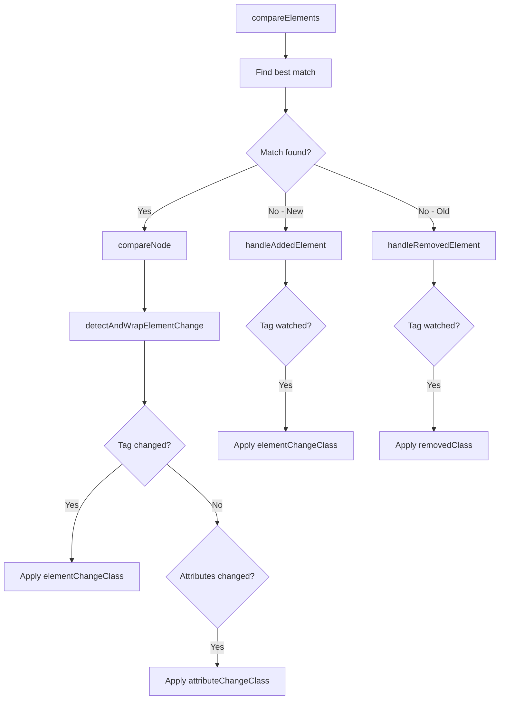

# 🎯 When `diff-element-changed` Class is Applied - Complete Guide

This document explains when and how the `diff-element-changed` CSS class (controlled by the `elementChangeClass` option) is applied in the Domoscope HTML diff engine.

## 📋 Table of Contents

- [Overview](#overview)
- [When the Class is Applied](#when-the-class-is-applied)
- [When the Class is NOT Applied](#when-the-class-is-not-applied)
- [Configuration Options](#configuration-options)
- [Code Examples](#code-examples)
- [Source Code Flow](#source-code-flow)
- [Related Classes](#related-classes)
- [Best Practices](#best-practices)

## 🔍 Overview

The `diff-element-changed` class (default value of `elementChangeClass` option) is applied to elements that have undergone specific types of structural changes during the diff operation. This class is primarily used for visual styling to highlight changed elements.

**Default class name**: `diff-elem-changed`  
**Configuration option**: `elementChangeClass`  
**Related options**: `watchedTags`, `onElementChange`

## ✅ When the Class is Applied

### 1. **Tag Name Changes** 🏷️

When two elements are matched during comparison but have different tag names:

```typescript
// Example: <span> changed to <div>
const oldHTML = '<span class="text">Hello</span>';
const newHTML = '<div class="text">Hello</div>';

// Result: Both old <span> and new <div> get wrapped with diff-elem-changed
```

**Source location**: `src/utils/index.ts` - `detectAndWrapElementChange()`

```typescript
const tagChanged = oldElement.tagName !== newElement.tagName;
if (tagChanged) {
  // Applies elementClass (diff-elem-changed) + diff-tag-changed
  wrapElement(oldElement, `${elementClass} diff-tag-changed`, wrapperTag);
  wrapElement(newElement, `${elementClass} diff-tag-changed`, wrapperTag);
}
```

### 2. **Added Elements (Watched Tags Only)** ➕

When a new element is added and its tag type is included in the `watchedTags` configuration:

```typescript
// Configuration
const options = {
  watchedTags: ['img', 'video'], // or ["*"] for all tags
};

// Example: New  tag added
const oldHTML = '<div><p>Text</p></div>';
const newHTML = '<div><p>Text</p></div>';

// Result:  gets wrapped with diff-elem-changed (because img is watched)
```

**Source location**: `src/core/index.ts` - `handleAddedElement()`

```typescript
if (shouldWatch) {
  // if tag is in watchedTags or watchedTags includes "*"
  const elementClass = this.options.elementChangeClass ?? 'diff-elem-changed';
  wrapElement(element, elementClass, wrapperTag);
}
```

### 3. **Custom Handler Scenarios** 🛠️

When `onElementChange` callback returns `undefined` (default behavior), the standard wrapping applies:

```typescript
const options = {
  watchedTags: ['*'],
  onElementChange: (oldEl, newEl, changeType) => {
    // Returning undefined triggers default wrapping
    return undefined;
  },
};
```

## ❌ When the Class is NOT Applied

### 1. **Attribute-Only Changes** 📝

When elements have the same tag name but different attributes:

```typescript
// Example: Only class attribute changed
const oldHTML = '<div class="old">Content</div>';
const newHTML = '<div class="new">Content</div>';

// Result: Uses diff-attr-changed class instead of diff-elem-changed
```

### 2. **Removed Elements** 🗑️

Removed elements use the `removedClass` (default: `diff-removed`) instead:

```typescript
// Example:  tag removed
const oldHTML = '<div><p>Text</p></div>';
const newHTML = '<div><p>Text</p></div>';

// Result:  gets diff-removed class, not diff-elem-changed
```

### 3. **Non-Watched Tags** 👁️‍🗨️

Added/removed elements whose tags are not in `watchedTags`:

```typescript
// Configuration
const options = {
  watchedTags: ['img'], // Only watching img tags
};

// Example: New <video> tag added (not watched)
const oldHTML = '<div><p>Text</p></div>';
const newHTML = '<div><p>Text</p><video src="video.mp4"></video></div>';

// Result: <video> gets data-diff-added-tag attribute but NO visual wrapping
```

### 4. **Custom Handler Opt-Out** 🚫

When `onElementChange` callback returns `null`:

```typescript
const options = {
  watchedTags: ['*'],
  onElementChange: (oldEl, newEl, changeType) => {
    // Returning null skips all wrapping
    return null;
  },
};
```

## ⚙️ Configuration Options

### Basic Configuration

```typescript
const options = {
  // Which tags to visually highlight when added/removed
  watchedTags: ['*'], // All tags, or ["img", "video", "div"] for specific tags

  // Custom CSS classes
  elementChangeClass: 'my-element-changed', // Default: "diff-elem-changed"
  attributeChangeClass: 'my-attr-changed', // Default: "diff-attr-changed"
  removedClass: 'my-removed', // Default: "diff-removed"
  addedClass: 'my-added', // Default: "diff-added"

  // Wrapper element
  wrapperTag: 'span', // Default: "span"
};
```

### Advanced Configuration

```typescript
const options = {
  watchedTags: ['*'],

  // Custom change handler
  onElementChange: (oldEl, newEl, changeType, changedAttrs) => {
    console.log(`Change detected: ${changeType}`);

    if (changeType === 'tag-added') {
      // Return custom wrapper element
      const wrapper = document.createElement('div');
      wrapper.className = 'custom-added-wrapper';
      return wrapper;
    }

    if (changeType === 'attribute' && changedAttrs?.includes('src')) {
      // Skip wrapping for src attribute changes
      return null;
    }

    // Use default behavior
    return undefined;
  },
};
```

## 📖 Code Examples

### Example 1: Tag Name Change

```typescript
import { getCustomDiffStats } from 'domoscope';

const oldHTML = '<button type="button">Click me</button>';
const newHTML = '<a href="#" role="button">Click me</a>';

const { diffResult } = getCustomDiffStats(oldHTML, newHTML, {
  watchedTags: ['*'],
  elementChangeClass: 'tag-changed',
});

// Result: Both <button> and <a> wrapped with "tag-changed diff-tag-changed"
```

### Example 2: New Element Added

```typescript
const oldHTML = '<div><p>Paragraph</p></div>';
const newHTML = '<div><p>Paragraph</p></div>';

const { diffResult, stats } = getCustomDiffStats(oldHTML, newHTML, {
  watchedTags: ['img'],
  elementChangeClass: 'new-element',
});

// Result:
// -  wrapped with "new-element" class
// - stats.addedTags.img === 1
// - stats.totalAddedTags === 1
```

### Example 3: Attribute Change Only

```typescript
const oldHTML = '';
const newHTML = '';

const { diffResult } = getCustomDiffStats(oldHTML, newHTML, {
  watchedTags: ['*'],
  attributeChangeClass: 'attrs-modified',
});

// Result:  wrapped with "attrs-modified" (NOT elementChangeClass)
```

## 🔄 Source Code Flow

### 1. Element Comparison Process



### 2. Key Functions

#### `detectAndWrapElementChange()` - src/utils/index.ts

- Compares old vs new elements
- Detects tag name and attribute differences
- Applies appropriate CSS classes

#### `handleAddedElement()` - src/core/index.ts

- Processes newly added elements
- Applies `elementChangeClass` for watched tags
- Always sets `data-diff-added-tag` for statistics

#### `handleRemovedElement()` - src/core/index.ts

- Processes removed elements
- Applies `removedClass` for watched tags
- Always sets `data-diff-removed-tag` for statistics

## 🎨 Related Classes

| Class               | Purpose                   | When Applied                                        |
| ------------------- | ------------------------- | --------------------------------------------------- |
| `diff-elem-changed` | Element structure changes | Tag name changes, watched tag additions             |
| `diff-attr-changed` | Attribute changes         | Same tag, different attributes                      |
| `diff-added`        | Added content             | Text additions, general additions                   |
| `diff-removed`      | Removed content           | Text removals, element removals                     |
| `diff-tag-changed`  | Tag name specific         | Added alongside `diff-elem-changed` for tag changes |

## 🎯 Best Practices

### 1. **Use Specific watchedTags**

```typescript
// ✅ Good: Only watch important structural elements
watchedTags: ['img', 'video', 'iframe', 'form', 'table'];

// ❌ Avoid: Watching all tags can be noisy
watchedTags: ['*'];
```

### 2. **Implement Custom Handlers for Complex Logic**

```typescript
onElementChange: (oldEl, newEl, changeType, changedAttrs) => {
  // Skip wrapping for minor attribute changes
  if (
    changeType === 'attribute' &&
    changedAttrs?.every((attr) => ['class', 'style'].includes(attr))
  ) {
    return null;
  }

  // Custom wrapper for important additions
  if (changeType === 'tag-added' && newEl?.tagName === 'IMG') {
    const wrapper = document.createElement('div');
    wrapper.className = 'important-image-addition';
    return wrapper;
  }

  return undefined; // Default behavior
};
```

### 3. **CSS Styling Guidelines**

```css
/* Element structure changes */
.diff-elem-changed {
  border: 2px dashed #ff6b35;
  background-color: rgba(255, 107, 53, 0.1);
  border-radius: 4px;
  margin: 2px;
}

/* Attribute changes */
.diff-attr-changed {
  outline: 2px solid #4285f4;
  outline-offset: 1px;
  border-radius: 2px;
}

/* Tag name changes */
.diff-tag-changed {
  position: relative;
}

.diff-tag-changed::before {
  content: 'TAG CHANGED';
  position: absolute;
  top: -20px;
  left: 0;
  background: #ff6b35;
  color: white;
  font-size: 10px;
  padding: 2px 6px;
  border-radius: 2px;
}
```

### 4. **Statistics Collection**

```typescript
const { diffResult, stats } = getCustomDiffStats(oldHTML, newHTML, {
  watchedTags: ['*'],
});

// Access detailed change information
console.log('Changed tags:', stats.changedTags);
console.log('Added tags:', stats.addedTags);
console.log('Removed tags:', stats.removedTags);
console.log('Total changes:', stats.totalChangedTags);
```

---

## 📚 Additional Resources

- [Main Documentation](README.md)
- [Configuration Guide](src/config/index.ts)
- [Type Definitions](src/types/options.ts)
- [Examples](examples/)

## 🤝 Contributing

Found an issue or want to improve this documentation? Please contribute to the [domoscope repository](https://github.com/rastaweb/domoscope).
