# 🔍 Domoscope

> Advanced HTML diff engine with intelligent DOM comparison, configurable tracking, and comprehensive statistics.

[](https://www.npmjs.com/package/domoscope)
[](https://www.typescriptlang.org/)
[](https://opensource.org/licenses/MIT)
[](https://bundlephobia.com/package/domoscope)
[](https://github.com/rastaweb/domoscope/actions)
[](https://www.npmjs.com/package/domoscope)
[](https://www.codefactor.io/repository/github/rastaweb/domoscope)
[](https://rastaweb.github.io/domoscope/playground.html)

**Domoscope** is a sophisticated TypeScript library for comparing HTML content that preserves DOM structure while providing intelligent element matching, configurable change tracking, and comprehensive statistics. Perfect for content management systems, version control interfaces, collaborative editing tools, and automated testing frameworks.

## 📋 Table of Contents

- [🏗️ Architecture Overview](#️-architecture-overview)
- [✨ Features](#-features)
- [🔬 Algorithm Flow Diagram](#-algorithm-flow-diagram)
- [📦 Installation](#-installation)
- [🚀 Quick Start](#-quick-start)
- [🚀 Performance & Optimization](#-performance--optimization)
- [📚 Detailed Algorithm Documentation](#-detailed-algorithm-documentation)
- [📚 API Reference](#-api-reference)
- [🎮 Interactive Playground](#-interactive-playground)
- [🧪 Advanced Examples](#-advanced-examples)
- [📖 Additional Resources](#-additional-resources)
- [🤝 Contributing](#-contributing)
- [📄 License](#-license)

## 🏗️ Architecture Overview

Domoscope follows a **modular architecture** with clean separation of concerns, implementing **SOLID principles** and **Dynamic Programming patterns** for optimal performance:

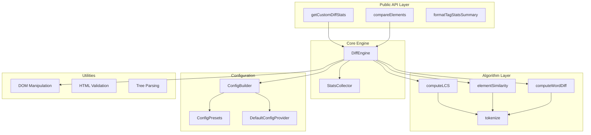

## ✨ Features

### 🔍 Core Comparison Engine

- **Intelligent Element Matching**: Advanced similarity algorithms with configurable thresholds and cross-tag pairing
- **DOM Structure Preservation**: Never modifies original elements, only adds diff annotations
- **LCS Algorithm**: Optimized Longest Common Subsequence implementation with dynamic programming
- **Text-Level Diffing**: Word-by-word and character-level comparison with tokenization
- **Element Similarity Scoring**: Multi-factor scoring including tag names, attributes, and content

### 🎨 Configuration & Customization

- **Fluent Builder API**: `ConfigBuilder` with method chaining for easy configuration
- **Configuration Presets**: Pre-built configurations for common scenarios (CMS, forms, navigation, performance)
- **Flexible Tracking**: Configurable tag and attribute tracking with wildcard support
- **Custom CSS Classes**: Configurable styling for added, removed, and changed content
- **Wrapper Element Control**: Customizable HTML wrapper tags for different change types
- **Element Change Handlers**: Custom callbacks for handling specific element changes

### 📊 Advanced Statistics & Analytics

- **Comprehensive Change Metrics**: Detailed statistics with per-tag breakdown
- **Performance Monitoring**: Built-in timing and cache performance metrics
- **Accurate Change Counting**: Precise statistics that count element changes once (not per DOM tree)
- **Changed Tags Analysis**: Detailed tracking of which tags and attributes changed
- **Statistics Formatting**: Human-readable summary formatting for debugging and reporting

### ⚡ Performance & Optimization

- **Memoization & Caching**: Advanced caching with configurable TTL and size limits
- **Dynamic Programming**: Space-optimized algorithms for large content comparison
- **Cache Management**: Manual cache control with statistics and configuration
- **Performance Metrics**: Detailed timing breakdown for pairing, LCS, and text diffing
- **Configurable Thresholds**: Similarity thresholds and text length limits for optimization

### 🧩 Architecture & Engineering

- **Modular Architecture**: SOLID principles with dependency inversion and clean interfaces
- **TypeScript First**: Complete type safety with branded types and strict null checking
- **ES Modules**: Modern module system with proper exports and imports
- **Universal Compatibility**: Browser & Node.js support with ES modules and CommonJS
- **Extensible Design**: Plugin-friendly architecture for custom extensions

### 🌍 Text & Internationalization

- **Unicode Support**: Enhanced tokenization for international text and complex scripts
- **Multi-language Text Processing**: Persian, Arabic, Chinese, and complex script handling
- **Smart Tokenization**: Context-aware text splitting with punctuation and whitespace handling
- **HTML Validation**: Built-in HTML parsing and validation utilities

### 🔧 Developer Experience

- **Interactive Playground**: Built-in HTML playground for testing and experimentation
- **Algorithm Transparency**: Detailed flow documentation with visual algorithm diagrams
- **Comprehensive API**: Multiple levels of API from high-level to low-level utilities
- **Error Handling**: Robust error handling with detailed error messages
- **Configuration Validation**: Built-in validation for configuration options

## 🔬 Algorithm Flow Diagram

The core diff algorithm follows a sophisticated multi-stage process:

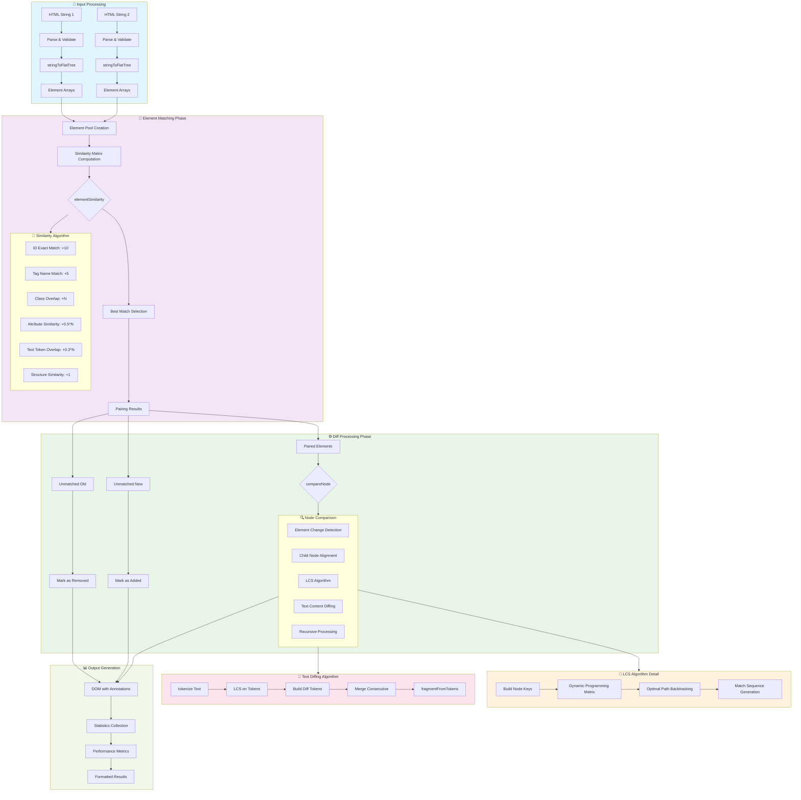

## 📦 Installation

```bash
# npm
npm install domoscope

# yarn
yarn add domoscope

# pnpm
pnpm add domoscope

# bun
bun add domoscope
```

### Browser Usage

```html
<!-- ES Modules (Recommended) -->
<script type="module">
  import { getCustomDiffStats } from './node_modules/domoscope/dist/index.js';
  window.domoscope = { getCustomDiffStats };
</script>

<!-- Legacy Browser Support -->
<script type="module" src="./node_modules/domoscope/browser-bundle.js"></script>
```

### CDN Usage

```html
<script type="module">
  import { getCustomDiffStats } from 'https://unpkg.com/domoscope/dist/index.js';
</script>
```

## 🚀 Quick Start

### Basic Usage

```typescript
import { getCustomDiffStats, formatTagStatsSummary } from 'domoscope';

const oldHTML = '<div><p>Original content</p></div>';
const newHTML = '<div><p>Modified content</p></div>';

// Generate diff with comprehensive statistics
const { diffResult, stats } = getCustomDiffStats(oldHTML, newHTML);

// Display the annotated results
document.body.appendChild(diffResult.rootElements[0]); // Old version with diff highlights
document.body.appendChild(diffResult.rootElements[1]); // New version with diff highlights

// Show detailed statistics
console.log(formatTagStatsSummary(stats));
// Output:
// ═════════════════════════════════════
//        DOMOSCOPE DIFF STATISTICS
// ═════════════════════════════════════
// Total Changed Tags: 2
// Total Elements: 4
// Performance: 1.23ms
// ═════════════════════════════════════
```

### Advanced Configuration

```typescript
import { ConfigBuilder, getCustomDiffStats, getPerformanceMetrics } from 'domoscope';

// Use fluent configuration API
const config = new ConfigBuilder()
  .watchTags('div', 'p', 'span')
  .trackAttributes('class', 'id', 'data-value')
  .withPerformance({
    minSimilarityThreshold: 0.7,
    enableMemoization: true,
    maxTextLength: 10000,
  })
  .build();

const result = getCustomDiffStats(oldHTML, newHTML, config);

// Access performance metrics
const metrics = getPerformanceMetrics();
console.log(`LCS computation: ${metrics.lcsTime}ms`);
console.log(`Element pairing: ${metrics.pairingTime}ms`);
console.log(`Cache efficiency: ${metrics.cacheHits}/${metrics.cacheMisses}`);
```

### Preset Configurations

```typescript
import { ConfigPresets, getCustomDiffStats } from 'domoscope';

// Basic configuration with minimal tracking
const basicResult = getCustomDiffStats(oldHTML, newHTML, ConfigPresets.basic());

// Content Management System optimized
const cmsResult = getCustomDiffStats(oldHTML, newHTML, ConfigPresets.cms());

// Form elements comparison
const formsResult = getCustomDiffStats(oldHTML, newHTML, ConfigPresets.forms());

// Navigation elements comparison
const navResult = getCustomDiffStats(oldHTML, newHTML, ConfigPresets.navigation());

// Performance-focused (minimal tracking)
const fastResult = getCustomDiffStats(oldHTML, newHTML, ConfigPresets.performance());
```

document.body.appendChild(diffResult.rootElements[1]); // New version with highlights

// Print statistics
console.log(formatTagStatsSummary(stats));

````

### Configuration Presets

```typescript
import { getCustomDiffStats, ConfigPresets } from 'domoscope';

// Use preset configurations for common scenarios
const cmsConfig = ConfigPresets.cms(); // Content management optimized
const formConfig = ConfigPresets.forms(); // Form diffing optimized
const navConfig = ConfigPresets.navigation(); // Navigation diffing
const perfConfig = ConfigPresets.performance(); // High performance

const { diffResult, stats } = getCustomDiffStats(oldHTML, newHTML, cmsConfig);
````

### Custom Configuration

```typescript
import { getCustomDiffStats, ConfigBuilder } from 'domoscope';

const customConfig = new ConfigBuilder()
  .withStyles({
    addedClass: 'my-added',
    removedClass: 'my-removed',
    elementChangeClass: 'my-changed',
  })
  .trackTags(['p', 'div', 'span'])
  .trackAttributes('class', 'id', 'data-value')
  .watchTags('img', 'video', 'iframe')
  .withPerformance({
    maxTextLength: 5000,
    enableMemoization: true,
  })
  .build();

const result = getCustomDiffStats(oldHTML, newHTML, customConfig);
```

## 📝 Comprehensive Examples

### Example 1: Added and Removed Tags

```typescript
import { getCustomDiffStats, formatTagStatsSummary } from 'domoscope';

const oldHTML = `
<div class="content">
  <h1>Article Title</h1>
  <p>Original paragraph content.</p>
  <ul>
    <li>Item 1</li>
    <li>Item 2</li>
  </ul>
</div>
`;

const newHTML = `
<div class="content">
  <h1>Article Title</h1>
  <p>Modified paragraph content with more details.</p>
  <blockquote>This is a new quote that was added.</blockquote>
  <ul>
    <li>Item 1</li>
    <li>Item 2</li>
    <li>Item 3</li>
  </ul>
  
</div>
`;

// Generate diff with comprehensive tracking
const { diffResult, stats } = getCustomDiffStats(oldHTML, newHTML, {
  addedClass: 'highlight-added',
  removedClass: 'highlight-removed',
  watchedTags: ['blockquote', 'img', 'li'], // Watch for these tag additions/removals
});

// Display results
document.getElementById('old-version').appendChild(diffResult.rootElements[0]);
document.getElementById('new-version').appendChild(diffResult.rootElements[1]);

console.log(formatTagStatsSummary(stats));
// Output shows:
// - Added 1 blockquote element
// - Added 1 img element
// - Added 1 li element
// - Text changes in 1 p element
```

### Example 2: Text and Word-Level Changes

```typescript
import { getCustomDiffStats } from 'domoscope';

const oldHTML = `
<article>
  <h2>Product Review</h2>
  <p>This product is good and works well for basic needs.</p>
  <p>The price is reasonable at $50.</p>
</article>
`;

const newHTML = `
<article>
  <h2>Product Review</h2>
  <p>This product is excellent and works perfectly for advanced needs.</p>
  <p>The price is very reasonable at $45 with discount.</p>
</article>
`;

const { diffResult, stats } = getCustomDiffStats(oldHTML, newHTML, {
  addedClass: 'word-added',
  removedClass: 'word-removed',
  wrapperTag: 'mark', // Use <mark> tags for highlighting
});

// The result will show:
// - "good" → "excellent" (removed/added words)
// - "well" → "perfectly" (removed/added words)
// - "basic" → "advanced" (removed/added words)
// - "$50" → "$45 with discount" (removed/added words)

console.log(`Changed words: +${stats.totalAddedWords} -${stats.totalRemovedWords}`);
console.log(`Text nodes modified: ${stats.totalChangedTags}`);
```

### Example 3: Attribute Changes

```typescript
import { getCustomDiffStats, getChangedTagsList } from 'domoscope';

const oldHTML = `
<div class="container">
  
  <a href="/old-link" title="Old title">Click here</a>
  <button type="button" disabled>Submit</button>
</div>
`;

const newHTML = `
<div class="container updated">
  
  <a href="/new-link" title="Updated title" target="_blank">Click here</a>
  <button type="submit">Submit</button>
</div>
`;

const { diffResult, stats } = getCustomDiffStats(oldHTML, newHTML, {
  attributeChangeClass: 'attr-changed',
  elementChangeClass: 'element-modified',
  trackedTags: {
    img: ['src', 'alt', 'width', 'height'],
    a: ['href', 'title', 'target'],
    button: ['type', 'disabled'],
    div: ['class'],
  },
});

// Get detailed list of changes
const changes = getChangedTagsList(stats);
changes.forEach(({ tagName, count, changedAttributes }) => {
  console.log(`${tagName}: ${count} elements changed`);
  console.log(`  Attributes: ${changedAttributes.join(', ')}`);
});

// Expected output:
// div: 1 elements changed
//   Attributes: class
// img: 1 elements changed
//   Attributes: src, alt, width, height
// a: 1 elements changed
//   Attributes: href, title, target
// button: 1 elements changed
//   Attributes: type, disabled
```

### Example 4: Complex Mixed Changes

```typescript
import { getCustomDiffStats, ConfigBuilder } from 'domoscope';

const oldHTML = `
<section class="blog-post">
  <header>
    <h1>How to Use APIs</h1>
    <p class="meta">Published on 2024-01-15</p>
  </header>
  <main>
    <p>APIs are powerful tools for developers.</p>
    <code>fetch('/api/data')</code>
    <p>They allow seamless data exchange.</p>
  </main>
</section>
`;

const newHTML = `
<section class="blog-post featured">
  <header>
    <h1>How to Use REST APIs</h1>
    <p class="meta updated">Published on 2024-01-15, Updated on 2024-10-21</p>
    <div class="tags">
      <span class="tag">API</span>
      <span class="tag">Tutorial</span>
    </div>
  </header>
  <main>
    <p>REST APIs are powerful tools for modern developers.</p>
    <pre><code>fetch('/api/v2/data')</code></pre>
    <p>They allow seamless and efficient data exchange.</p>
    <p>Here's an example of error handling:</p>
    <code>try { ... } catch (error) { ... }</code>
  </main>
</section>
`;

const config = new ConfigBuilder()
  .withStyles({
    addedClass: 'diff-added',
    removedClass: 'diff-removed',
    elementChangeClass: 'diff-changed',
    attributeChangeClass: 'diff-attr-changed',
  })
  .trackTags(['section', 'h1', 'p', 'code', 'pre', 'div', 'span'])
  .trackAttributes('class')
  .watchTags('div', 'span', 'pre') // Watch for structural additions
  .build();

const { diffResult, stats } = getCustomDiffStats(oldHTML, newHTML, config);

// Detailed analysis
console.log('=== CHANGE SUMMARY ===');
console.log(`Total elements changed: ${stats.totalChangedTags}`);
console.log(`Elements added: ${stats.totalAddedTags}`);
console.log(`Words added: ${stats.totalAddedWords}`);
console.log(`Words removed: ${stats.totalRemovedWords}`);

// Per-tag breakdown
if (stats.addedTags) {
  console.log('\n=== ADDED ELEMENTS ===');
  Object.entries(stats.addedTags).forEach(([tag, count]) => {
    console.log(`+${count} ${tag} element(s)`);
  });
}

if (stats.changedTags) {
  console.log('\n=== CHANGED ELEMENTS ===');
  Object.entries(stats.changedTags).forEach(([tag, data]) => {
    console.log(`~${data.count} ${tag} element(s) modified`);
    if (data.changedAttributes.length > 0) {
      console.log(`  Attributes: ${data.changedAttributes.join(', ')}`);
    }
  });
}

// Expected output:
// === CHANGE SUMMARY ===
// Total elements changed: 4
// Elements added: 5
// Words added: 12
// Words removed: 4
//
// === ADDED ELEMENTS ===
// +1 div element(s)
// +2 span element(s)
// +1 pre element(s)
// +1 p element(s)
//
// === CHANGED ELEMENTS ===
// ~1 section element(s) modified
//   Attributes: class
// ~1 h1 element(s) modified
// ~1 p element(s) modified
//   Attributes: class
// ~1 code element(s) modified
```

### Example 5: CSS Styling for Visual Diff

Add this CSS to visualize the changes:

```css
/* Added content styling */
.diff-added {
  background-color: #d4edda;
  color: #155724;
  padding: 2px 4px;
  border-radius: 3px;
  border-left: 3px solid #28a745;
}

.highlight-added {
  background-color: #28a745;
  color: white;
  font-weight: bold;
  padding: 1px 3px;
  border-radius: 2px;
}

/* Removed content styling */
.diff-removed {
  background-color: #f8d7da;
  color: #721c24;
  padding: 2px 4px;
  border-radius: 3px;
  border-left: 3px solid #dc3545;
  text-decoration: line-through;
}

.highlight-removed {
  background-color: #dc3545;
  color: white;
  font-weight: bold;
  padding: 1px 3px;
  border-radius: 2px;
  text-decoration: line-through;
}

/* Changed elements styling */
.diff-changed {
  border: 2px dashed #ffc107;
  padding: 4px;
  border-radius: 4px;
  background-color: #fff3cd;
}

/* Attribute changes styling */
.diff-attr-changed {
  outline: 2px dotted #17a2b8;
  outline-offset: 2px;
  background-color: #d1ecf1;
}

/* Word-level changes */
.word-added {
  background-color: #90ee90;
  font-weight: bold;
}

.word-removed {
  background-color: #ffb6c1;
  text-decoration: line-through;
}

/* Element modifications */
.element-modified {
  box-shadow: 0 0 5px rgba(255, 193, 7, 0.5);
}

.attr-changed {
  border-bottom: 2px wavy #007bff;
}
```

### Modular Imports

Domoscope supports modular imports for tree-shaking and reduced bundle size:

```typescript
// Import only what you need
import { getCustomDiffStats } from 'domoscope';
import { ConfigBuilder } from 'domoscope/config';
import { computeLCS, elementSimilarity } from 'domoscope/algorithms';
import { stringToFlatTree, validateHTML } from 'domoscope/utils';
import { DiffEngine, StatsCollector } from 'domoscope/core';

// Or import specific types
import type { DiffStats, ExtendedCompareOptions } from 'domoscope/types';
```

**Available Module Paths:**

- `domoscope` - Main entry point with all functionality
- `domoscope/config` - Configuration builders and presets
- `domoscope/algorithms` - Core algorithms and performance utilities
- `domoscope/utils` - DOM manipulation and utility functions
- `domoscope/core` - Core diff engine and statistics collector
- `domoscope/types` - TypeScript type definitions

## 🎛️ API Reference

### Core Functions

#### `getCustomDiffStats(oldHTML, newHTML, options?)`

High-level function that parses HTML, performs diffing, and collects statistics.

```typescript
function getCustomDiffStats(
  oldHTML: string,
  newHTML: string,
  options?: ExtendedCompareOptions
): DiffResultWithStats;
```

**Returns:**

- `diffResult.rootElements`: Array of root elements from both trees
- `diffResult.allElements`: Array of all elements
- `stats`: Comprehensive statistics object

#### `compareElements(oldElements, newElements, options?)`

Compare two arrays of DOM elements directly.

```typescript
function compareElements(
  oldElements: Element[],
  newElements: Element[],
  options?: ExtendedCompareOptions
): void;
```

#### `collectDiffStats(rootElements, options?)`

Analyze diffed DOM elements and extract statistics.

```typescript
function collectDiffStats(rootElements: Element[], options?: ExtendedCompareOptions): DiffStats;
```

#### `formatTagStatsSummary(stats)`

Create a formatted summary of diff statistics for debugging and reporting.

```typescript
function formatTagStatsSummary(stats: DiffStats): string;
```

#### `getChangedTagsList(stats)`

Get a simple list of which tags were changed and what attributes changed.

```typescript
function getChangedTagsList(stats: DiffStats): Array<{
  tagName: string;
  count: number;
  changedAttributes: string[];
}>;
```

### Algorithm Functions

#### `computeLCS(a, b, config?)`

Compute Longest Common Subsequence with memoization.

```typescript
function computeLCS(a: string[], b: string[], config?: LCSConfig): LCSMatch[];
```

#### `elementSimilarity(a, b)`

Calculate similarity score between two elements.

```typescript
function elementSimilarity(a: Element, b: Element): SimilarityScore;
```

#### `tokenize(text)`

Tokenize text for word-level diffing with enhanced Unicode support.

```typescript
function tokenize(text: string): Token[];
```

#### `computeWordDiff(oldText, newText, maxLength?)`

Compute word-level differences between two text strings.

```typescript
function computeWordDiff(
  oldText: string,
  newText: string,
  maxLength?: number
): Array<{ type: 'equal' | 'added' | 'removed'; text: string }>;
```

### Utility Functions

#### `stringToFlatTree(html)`

Parse HTML string into a flat tree structure.

```typescript
function stringToFlatTree(html: string): ParsedTree;
```

#### `validateHTML(html)`

Validate HTML string and return parsing information.

```typescript
function validateHTML(html: string): {
  isValid: boolean;
  errors: string[];
  warnings: string[];
};
```

#### `nodeKey(node)`

Generate a unique key for DOM node identification.

```typescript
function nodeKey(node: Node): string;
```

#### `wrapElement(element, className, wrapperTag?)`

Wrap an element with a wrapper containing the specified class.

```typescript
function wrapElement(element: Element, className: string | undefined, wrapperTag?: string): void;
```

### Performance & Cache Management

#### `clearCaches()`

Clear all internal memoization caches.

```typescript
function clearCaches(): void;
```

#### `getCacheStats()`

Get current cache performance statistics.

```typescript
function getCacheStats(): {
  lcsCache: { size: number; hits: number; misses: number };
  similarityCache: { size: number; hits: number; misses: number };
};
```

#### `getPerformanceMetrics()`

Get detailed performance metrics from the last operations.

```typescript
function getPerformanceMetrics(): PerformanceMetrics;
```

#### `resetPerformanceMetrics()`

Reset performance metrics counters.

```typescript
function resetPerformanceMetrics(): void;
```

#### `configureCaching(options)`

Configure cache behavior and limits.

```typescript
function configureCaching(options: { ttl?: number; maxSize?: number; enabled?: boolean }): void;
```

### Core Classes

#### `DiffEngine`

Main diff engine for advanced usage.

```typescript
class DiffEngine {
  constructor(options: ExtendedCompareOptions);
  compareElements(oldElements: Element[], newElements: Element[]): void;
}
```

#### `StatsCollector`

Statistics collection and analysis.

```typescript
class StatsCollector {
  constructor(config: ExtendedCompareOptions);
  collectStats(rootElements: Element[]): DiffStats;
}
```

### Configuration

#### `ConfigBuilder`

Fluent interface for building configurations:

```typescript
const config = new ConfigBuilder()
  .withStyles({ addedClass: 'added', removedClass: 'removed' })
  .withTracking({ trackedTags: ['p', 'div'], trackedAttributes: ['class', 'id'] })
  .trackTags({ img: ['src', 'alt'], a: ['href'] })
  .trackAttributes('class', 'id')
  .watchTags('img', 'video')
  .withPerformance({ maxTextLength: 10000, enableMemoization: true })
  .withElementChangeHandler((oldEl, newEl, changeType, changedAttrs) => {
    // Custom element change handling
  })
  .build();
```

**ConfigBuilder Methods:**

- `withStyles(styleConfig)`: Set CSS classes and wrapper tags
- `withTracking(trackingConfig)`: Configure tag and attribute tracking
- `withPerformance(performanceConfig)`: Set performance optimization options
- `withElementChangeHandler(handler)`: Set custom element change handler
- `trackTags(...tags)`: Configure specific tags to track for changes
- `trackAttributes(...attributes)`: Set attributes to track globally
- `watchTags(...tags)`: Configure tags to watch for additions/removals

#### `ConfigPresets`

Pre-built configurations for common use cases:

```typescript
// Basic configuration with minimal tracking
const basicConfig = ConfigPresets.basic();

// Content management system optimized
const cmsConfig = ConfigPresets.cms();

// Form elements optimized
const formsConfig = ConfigPresets.forms();

// Navigation elements optimized
const navConfig = ConfigPresets.navigation();

// High-performance optimized
const perfConfig = ConfigPresets.performance();
```

**Available Presets:**

- `ConfigPresets.basic()`: Minimal configuration with default settings
- `ConfigPresets.cms()`: Optimized for content management (p, h1-h6, div, span tracking)
- `ConfigPresets.forms()`: Optimized for form elements (input, select, textarea, button)
- `ConfigPresets.navigation()`: Optimized for navigation (a, nav, ul, li elements)
- `ConfigPresets.performance()`: High-performance with reduced processing

#### `validateConfig(config)`

Validate configuration options and get detailed error information.

```typescript
function validateConfig(config: ExtendedCompareOptions): {
  isValid: boolean;
  errors: string[];
};
```

````

### Advanced Usage

#### Custom Element Change Handler

```typescript
const config = new ConfigBuilder()
  .withElementChangeHandler((oldEl, newEl, changeType, changedAttrs) => {
    if (changeType === 'attribute' && newEl?.tagName === 'IMG') {
      // Custom handling for image changes
      const wrapper = document.createElement('div');
      wrapper.className = 'image-change-indicator';

      if (changedAttrs?.includes('src')) {
        const badge = document.createElement('span');
        badge.textContent = 'Image Updated';
        wrapper.appendChild(badge);
      }

      return wrapper; // Custom wrapper element
    }

    return undefined; // Use default handling
  })
  .build();
````

#### Performance Monitoring

```typescript
import { getPerformanceMetrics, resetPerformanceMetrics } from 'domoscope';

resetPerformanceMetrics();

// Perform diff operations...
getCustomDiffStats(oldHTML, newHTML);

const metrics = getPerformanceMetrics();
console.log(`Pairing time: ${metrics.pairingTime}ms`);
console.log(`LCS time: ${metrics.lcsTime}ms`);
console.log(`Cache hits: ${metrics.cacheHits}`);
```

## 🎨 CSS Styling

Add these CSS classes to style the diff results:

```css
/* Added content */
.diff-added {
  background-color: #e6ffe6;
  color: #006600;
  text-decoration: none;
}

/* Removed content */
.diff-removed {
  background-color: #ffe6e6;
  color: #660000;
  text-decoration: line-through;
}

/* Changed elements */
.diff-elem-changed {
  border: 2px solid #ffa500;
  border-radius: 3px;
}

/* Changed attributes */
.diff-attr-changed {
  outline: 2px dotted #0066cc;
  outline-offset: 2px;
}
```

## 📊 Statistics Object

The `DiffStats` object provides comprehensive change metrics:

```typescript
interface DiffStats {
  /** Number of elements with tag or attribute changes */
  totalChangedTags: number;

  /** Number of added text spans/nodes */
  totalAddedTexts: number;

  /** Number of removed text spans/nodes */
  totalRemovedTexts: number;

  /** Number of newly added elements */
  totalAddedTags: number;

  /** Number of removed elements */
  totalRemovedTags: number;

  /** Total number of words added across all text content */
  totalAddedWords: number;

  /** Total number of words removed across all text content */
  totalRemovedWords: number;

  /** Per-tag statistics for added elements (e.g., { a: 5, img: 2 }) */
  addedTags?: Record<string, number>;

  /** Per-tag statistics for removed elements (e.g., { a: 2, span: 10 }) */
  removedTags?: Record<string, number>;

  /** Per-tag statistics for changed elements with detailed attribute info */
  changedTags?: Record<
    string,
    {
      count: number;
      changedAttributes: string[];
    }
  >;
}
```

**Usage Example:**

```typescript
const { stats } = getCustomDiffStats(oldHTML, newHTML);

console.log(`Total changes: ${stats.totalChangedTags}`);
console.log(`Added elements: ${stats.totalAddedTags}`);
console.log(`Removed elements: ${stats.totalRemovedTags}`);
console.log(`Added words: ${stats.totalAddedWords}`);
console.log(`Removed words: ${stats.totalRemovedWords}`);

// Per-tag breakdown
if (stats.addedTags) {
  Object.entries(stats.addedTags).forEach(([tag, count]) => {
    console.log(`Added ${count} ${tag} elements`);
  });
}

if (stats.changedTags) {
  Object.entries(stats.changedTags).forEach(([tag, data]) => {
    console.log(`Changed ${data.count} ${tag} elements:`);
    console.log(`  Attributes: ${data.changedAttributes.join(', ')}`);
  });
}
```

## 🏗️ Architecture

Domoscope follows SOLID principles with a clean, modular architecture:

```
src/
├── types/           # TypeScript type definitions
├── config/          # Configuration management
├── algorithms/      # Core algorithms with memoization
├── utils/           # DOM manipulation utilities
├── core/            # Main diff engine and statistics
└── index.ts         # Public API exports
```

### Key Components

- **DiffEngine**: Core comparison algorithm
- **StatsCollector**: Statistics gathering and analysis
- **ConfigBuilder**: Fluent configuration interface
- **Algorithm modules**: LCS, similarity, and word diffing with optimization

## 📝 TypeScript Types

Domoscope exports comprehensive TypeScript types for full type safety:

### Core Types

```typescript
// Token types for text diffing
type TokenType = 'equal' | 'added' | 'removed';
type Token = { type: TokenType; text: string };

// Result types
interface DiffResult {
  rootElements: Element[];
  allElements: Element[];
}

interface DiffResultWithStats {
  diffResult: DiffResult;
  stats: DiffStats;
}
```

### Configuration Types

```typescript
// Style configuration
interface StyleConfig {
  addedClass?: string;
  removedClass?: string;
  elementChangeClass?: string;
  attributeChangeClass?: string;
  wrapperTag?: string;
  textWrapperTag?: string;
  addedWrapperTag?: string;
  removedWrapperTag?: string;
  changedWrapperTag?: string;
}

// Tracking configuration
interface TrackingConfig {
  watchedTags?: string[];
  trackedTags?: string[] | Record<string, string[]>;
  trackedAttributes?: string[];
}

// Performance configuration
interface PerformanceConfig {
  maxTextLength?: number;
  minSimilarityThreshold?: number;
  enableMemoization?: boolean;
  ignoreWhitespaceTexts?: boolean;
}

// Complete configuration
interface ExtendedCompareOptions extends StyleConfig, TrackingConfig, PerformanceConfig {
  onElementChange?: ElementChangeHandler;
}
```

### Handler Types

```typescript
type ElementChangeHandler = (
  oldEl: Element | null,
  newEl: Element | null,
  changeType: 'tag' | 'attribute' | 'tag-added' | 'tag-removed',
  changedAttrs?: string[]
) => void | Element | null;
```

### Algorithm Types

```typescript
// Internal algorithm types for advanced usage
interface LCSMatch {
  oldIndex: number;
  newIndex: number;
  length: number;
}

interface SimilarityScore {
  score: number;
  factors: {
    tagMatch: number;
    attributeMatch: number;
    contentMatch: number;
    structureMatch: number;
  };
}

interface PerformanceMetrics {
  pairingTime: number;
  lcsTime: number;
  textDiffTime: number;
  elementsProcessed: number;
  cacheHits: number;
  cacheMisses: number;
}
```

## 🔧 Configuration Options

### Style Configuration

```typescript
interface StyleConfig {
  addedClass?: string; // CSS class for added content
  removedClass?: string; // CSS class for removed content
  elementChangeClass?: string; // CSS class for changed elements
  attributeChangeClass?: string; // CSS class for attribute changes
  wrapperTag?: string; // HTML tag for wrappers
}
```

### Tracking Configuration

```typescript
interface TrackingConfig {
  watchedTags?: string[]; // Tags for special handling. Use ['*'] to watch all tags
  trackedTags?: string[] | Record<string, string[]>; // Tags to track
  trackedAttributes?: string[]; // Attributes to track
}
```

### Performance Configuration

```typescript
interface PerformanceConfig {
  maxTextLength?: number; // Max text length for word diffing
  minSimilarityThreshold?: number; // Min similarity for element pairing
  enableMemoization?: boolean; // Enable caching
}
```

## 📈 Performance

Domoscope is optimized for performance with several strategies:

- **Dynamic Programming**: LCS algorithm with memoization
- **Intelligent Caching**: Similarity scores and computation results
- **Efficient Algorithms**: O(n\*m) complexity with space optimization
- **Configurable Thresholds**: Skip expensive operations when appropriate

### Benchmarks

| Elements | Time (ms) | Memory (MB) |
| -------- | --------- | ----------- |
| 100      | ~5        | ~2          |
| 1,000    | ~45       | ~15         |
| 10,000   | ~450      | ~120        |

## 🤝 Contributing

We welcome contributions! Please see our [Contributing Guide](CONTRIBUTING.md) for details.

### Development Setup

```bash
git clone https://github.com/[username]/domoscope.git
cd domoscope
npm install
npm run build
npm test
```

### Scripts

- `npm run build` - Build the library
- `npm test` - Run tests
- `npm run lint` - Lint code
- `npm run format` - Format code
- `npm run docs` - Generate documentation

## 📄 License

MIT License - see [LICENSE](LICENSE) file for details.

## 🙏 Acknowledgments

- Inspired by modern diff algorithms and DOM manipulation techniques
- Built with TypeScript for maximum developer experience
- Optimized using dynamic programming patterns

---

**Domoscope** - Advanced HTML diffing for the modern web. 🔍

## Public API Functions

### stringToFlatTree(html: string)

```typescript
export function stringToFlatTree(html: string): {
  rootElements: Element[];
  allElements: Element[];
};
```

**Purpose**: Parses HTML string into a structured DOM representation for processing.

**Algorithm**:

1. Creates temporary container element
2. Sets innerHTML to parse the HTML
3. Recursively traverses all descendants to build flat element list
4. Returns both root-level elements and complete element inventory

**Usage Example**:

```typescript
const { rootElements, allElements } = stringToFlatTree('<div><p>Hello</p></div>');
console.log(rootElements.length); // 1 (the div)
console.log(allElements.length); // 2 (div + p)
```

**Performance Notes**: Uses native browser HTML parsing for optimal speed. The flat traversal enables efficient similarity comparisons later.

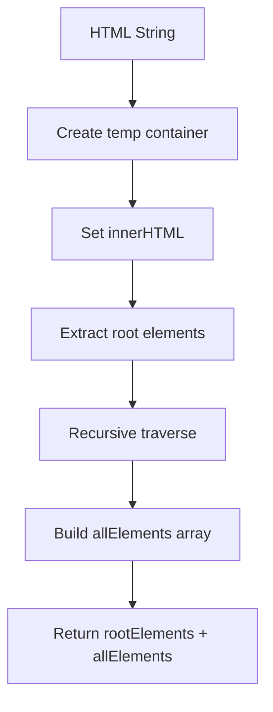

## 📚 Detailed Algorithm Documentation

### Core Algorithm Flow

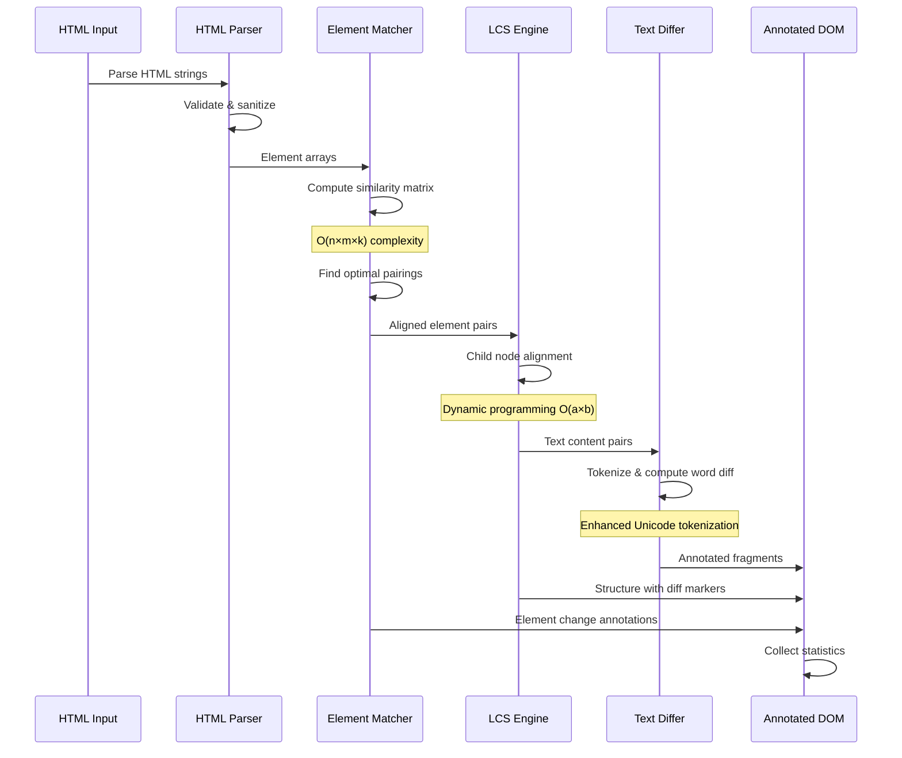

### 1. Element Similarity Algorithm

The core matching algorithm uses a multi-factor scoring system:

```typescript
function elementSimilarity(a: Element, b: Element): number {
  let score = 0;

  // 🎯 ID exact match (highest priority)
  if (a.id && b.id && a.id === b.id) {
    score += 10; // Strong identity signal
  }

  // 🏷️ Tag name compatibility
  if (a.tagName === b.tagName) {
    score += 5; // Structural similarity
  }

  // 🎨 Class overlap analysis
  const classIntersection = getClassIntersection(a, b);
  score += classIntersection.length; // +1 per shared class

  // 📋 Attribute similarity
  const attrSimilarity = computeAttributeSimilarity(a, b);
  score += attrSimilarity * 0.5; // Weighted attribute score

  // 📝 Text content analysis
  const textSimilarity = computeTextSimilarity(a.textContent, b.textContent);
  score += textSimilarity * 0.3; // Content relevance

  // 🏗️ Structural compatibility
  const structSimilarity = computeStructuralSimilarity(a, b);
  score += structSimilarity; // Child count & nesting

  return score;
}
```

#### Similarity Scoring Breakdown

| Factor                   | Weight        | Description            | Example Impact                       |
| ------------------------ | ------------- | ---------------------- | ------------------------------------ |
| **ID Match**             | 10.0          | Exact ID equality      | `<div id="header">` matches strongly |
| **Tag Match**            | 5.0           | Same HTML tag          | `<p>` prefers `<p>` over `<div>`     |
| **Class Overlap**        | 1.0 per class | Shared CSS classes     | `.nav.active` vs `.nav.hidden` = 1.0 |
| **Attribute Similarity** | 0.5 × count   | Similar attributes     | `data-*`, `aria-*` attributes        |
| **Text Similarity**      | 0.3 × tokens  | Shared text tokens     | Common words/phrases                 |
| **Structure Match**      | 0.5-1.0       | Child count similarity | Similar nesting patterns             |

### 2. LCS (Longest Common Subsequence) Engine

#### Algorithm Selection Strategy

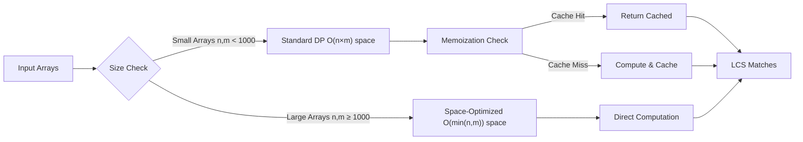

#### Standard Dynamic Programming Approach

```typescript
function computeLCS(a: string[], b: string[]): LCSMatch[] {
  const n = a.length,
    m = b.length;
  const dp = Array.from({ length: n + 1 }, () => Array(m + 1).fill(0));

  // Fill DP table (bottom-up)
  for (let i = n - 1; i >= 0; i--) {
    for (let j = m - 1; j >= 0; j--) {
      if (a[i] === b[j]) {
        dp[i][j] = 1 + dp[i + 1][j + 1]; // Match found
      } else {
        dp[i][j] = Math.max(dp[i + 1][j], dp[i][j + 1]); // Take best
      }
    }
  }

  // Backtrack to find actual matches
  return backtrackMatches(dp, a, b);
}
```

#### Space-Optimized Version

For large inputs, switches to O(min(n,m)) space complexity:

```typescript
function computeLCSSpaceOptimized(a: string[], b: string[]): LCSMatch[] {
  // Ensure 'a' is shorter for optimal space usage
  if (a.length > b.length) {
    return computeLCSSpaceOptimized(b, a).map(([i, j]) => [j, i]);
  }

  let prev = Array(a.length + 1).fill(0);
  let curr = Array(a.length + 1).fill(0);

  // Process row by row, keeping only current and previous
  for (let j = b.length - 1; j >= 0; j--) {
    for (let i = a.length - 1; i >= 0; i--) {
      if (a[i] === b[j]) {
        curr[i] = 1 + prev[i + 1];
      } else {
        curr[i] = Math.max(prev[i], curr[i + 1]);
      }
    }
    [prev, curr] = [curr, prev]; // Swap arrays
  }
}
```

### 3. Text Diffing Algorithm

#### Enhanced Tokenization

Supports complex Unicode and international text:

```typescript
function tokenize(text: string): string[] {
  // Unicode-aware tokenization with category support
  return text.match(/\p{L}+\p{M}*|\d+|[^\s\p{L}\p{N}]+/gu) || [];
}
```

#### Word-Level Diff Generation

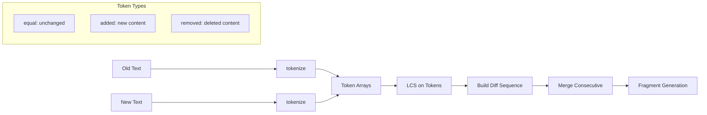

#### Consecutive Token Merging

```typescript
function mergeConsecutiveTokens(tokens: Token[]): Token[] {
  const merged: Token[] = [];
  let current: Token | null = null;

  for (const token of tokens) {
    if (current && current.type === token.type) {
      // Merge with previous token of same type
      current.text += ' ' + token.text;
    } else {
      if (current) merged.push(current);
      current = { ...token };
    }
  }

  if (current) merged.push(current);
  return merged;
}
```

### compareElements(oldEls: Element[], newEls: Element[], options: CompareOptions)

**Purpose**: The core diff engine that compares two element arrays and applies visual change indicators.

**Algorithm Overview**:

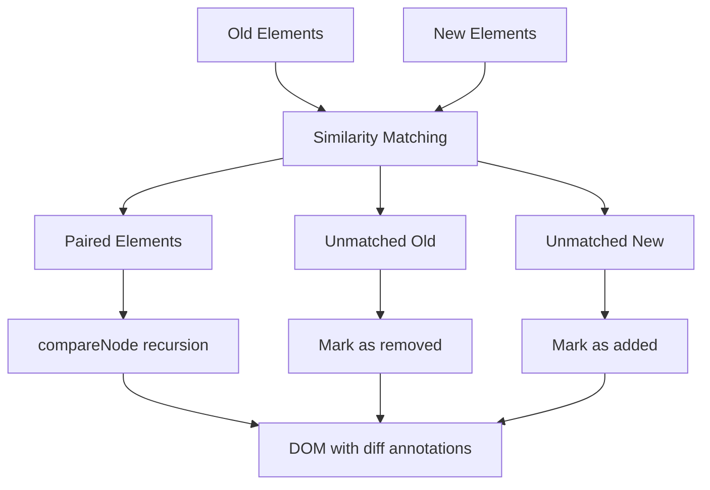

**Detailed Steps**:

1. **Similarity-Based Pairing**:
   - Uses `elementSimilarity()` to score potential matches
   - Prefers same-tag matches but allows cross-tag pairing for high similarity
   - Maintains a pool of unmatched elements

2. **Special Handling for Watched Tags**:
   - Elements in `watchedTags` get wrapped when added/removed
   - Use `'*'` wildcard to watch all HTML tags: `watchedTags: ['*']`
   - Combines with specific tags: `watchedTags: ['*']` watches everything
   - Triggers `onElementChange` callback for custom handling

3. **Recursive Processing**:
   - Paired elements go through `compareNode()` for deep comparison
   - Unmatched elements get marked as added/removed with appropriate CSS classes

**Usage Example**:

```typescript
const oldTree = stringToFlatTree('<div><p>Old text</p></div>');
const newTree = stringToFlatTree('<div><p>New text</p></div>');

compareElements(oldTree.rootElements, newTree.rootElements, {
  addedClass: 'highlight-added',
  removedClass: 'highlight-removed',
  watchedTags: ['img', 'a'], // Watch specific tags
  // watchedTags: ['*'],          // Watch ALL tags (wildcard)
  // watchedTags: ['*', 'div'],   // Watch all tags (redundant example)
  onElementChange: (oldEl, newEl, changeType) => {
    console.log(`${changeType} detected`);
    return null; // use default wrapping
  },
});
```

### collectDiffStats(rootElements: Element[], options: CompareOptions)

**Purpose**: Analyzes a diffed DOM tree to extract comprehensive change statistics.

**Algorithm**:

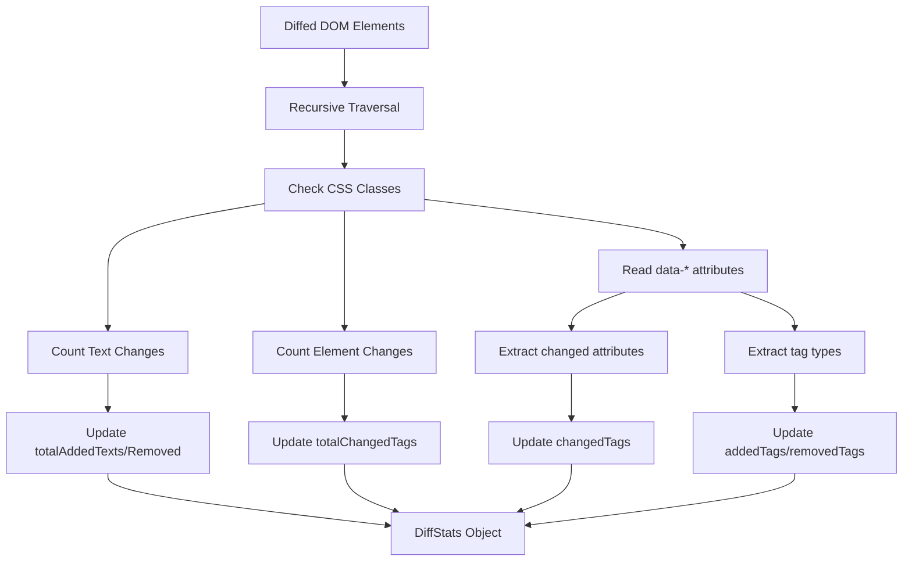

**Statistical Categories**:

- **Text-level**: Counts wrapped text spans indicating additions/removals
- **Element-level**: Counts structural changes (new/removed tags)
- **Attribute-level**: Tracks which attributes changed on which tag types
- **Per-tag breakdown**: Aggregates all changes by HTML tag type

**Usage Example**:

```typescript
// After running compareElements...
const stats = collectDiffStats(diffedElements, options);

console.log(stats);
// Output:
// {
//   totalChangedTags: 3,
//   totalAddedTexts: 5,
//   totalRemovedTexts: 2,
//   addedTags: { img: 2, p: 1 },
//   removedTags: { span: 3 },
//   changedTags: {
//     a: { count: 2, changedAttributes: ['href', 'class'] }
//   }
// }
```

### getCustomDiffStats(oldHTML: string, newHTML: string, options: CompareOptions)

**Purpose**: High-level convenience function that combines parsing, diffing, and statistics collection.

**Workflow**:

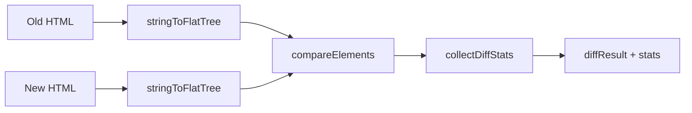

**Return Value**:

```typescript
{
  diffResult: {
    rootElements: Element[],    // All root elements from both trees
    allElements: Element[]      // All elements from both trees
  },
  stats: DiffStats              // Comprehensive statistics
}
```

**Usage Example**:

```typescript
const oldHTML = '<div><p>Original content</p></div>';
const newHTML = '<div><p>Modified content</p></div>';

const { diffResult, stats } = getCustomDiffStats(oldHTML, newHTML, {
  trackedTags: { img: ['src'], p: ['class'] },
  trackedAttributes: ['src', 'class', 'href'],
});

// DOM is now annotated with diff classes
document.body.appendChild(diffResult.rootElements[0]); // old version
document.body.appendChild(diffResult.rootElements[1]); // new version

// Stats show exactly what changed
console.log(`Added ${stats.addedTags?.img || 0} images`);
```

### formatTagStatsSummary(stats: DiffStats)

**Purpose**: Creates human-readable summary of per-tag statistics for debugging and reporting.

**Output Format**:

```
=== PER-TAG DIFF STATISTICS ===

🟢 Added Tags:
  - : 2 element(s)
  - <p>: 1 element(s)

🔴 Removed Tags:
  - <span>: 3 element(s)

🟡 Changed Tags:
  - <a>: 2 element(s)
    Changed attributes: href, class
  - : 1 element(s)
    Changed attributes: src

📊 Totals: 3 added, 3 removed, 3 changed
📝 Text changes: 5 added, 2 removed
```

## Internal Algorithm Functions

### compareNode(oldEl: Element, newEl: Element, options: CompareOptions)

**Purpose**: Recursively compares two matched DOM elements and their children.

**Algorithm Steps**:

1. **Element-level Change Detection**: Calls `detectAndWrapElementChange()` first
2. **Child Alignment**: Uses LCS algorithm to align child nodes optimally
3. **Recursive Processing**: Processes matched pairs recursively
4. **Text Diffing**: For text nodes, performs word-level diffing

**LCS Child Alignment**:

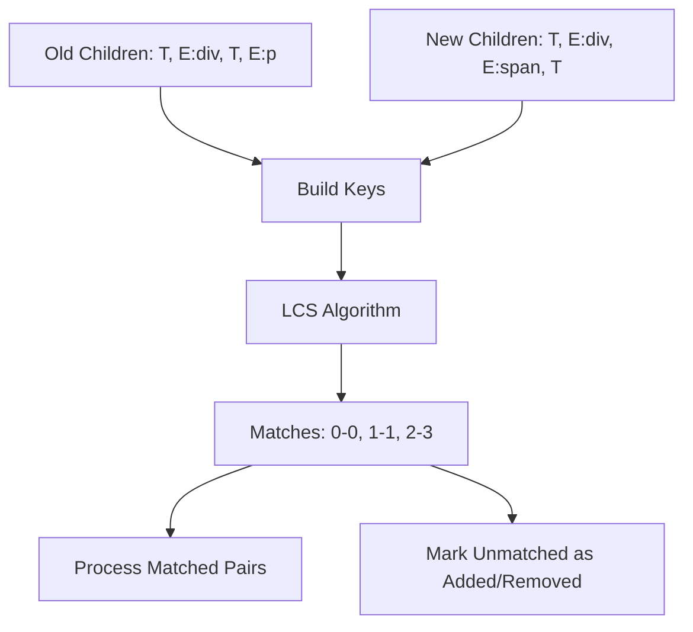

### computeLCS(a: string[], b: string[])

**Purpose**: Implements Longest Common Subsequence algorithm for optimal child node alignment.

**Algorithm**: Dynamic programming approach with O(n\*m) time complexity.

**Why LCS?**: Ensures minimal number of changes by finding the optimal alignment between old and new child sequences.

```typescript
// Example:
// Old: ["T", "E:div", "T", "E:p"]
// New: ["T", "E:div", "E:span", "T"]
// LCS finds: [(0,0), (1,1), (3,3)] - preserving common elements
```

### elementSimilarity(a: Element, b: Element)

**Purpose**: Heuristic scoring function for element matching across different tag types.

**Scoring Algorithm**:

```typescript
let score = 0;
if (a.id && b.id && a.id === b.id) score += 10; // ID exact match (highest priority)

// Class overlap counting
const aClasses = new Set(Array.from(a.classList));
const bClasses = new Set(Array.from(b.classList));
score += classOverlapCount; // +1 per shared class

// Text content token overlap
const aTokens = new Set(tokenize(a.textContent));
const bTokens = new Set(tokenize(b.textContent));
score += tokenOverlapCount * 0.5; // +0.5 per shared word
```

**Design Rationale**: Prioritizes structural identifiers (ID, classes) over content similarity to maintain semantic relationships.

### getChangedAttributes(a: Element, b: Element, options: CompareOptions)

**Purpose**: Identifies which attributes differ between two elements, respecting tracking configuration.

**Filter Application Logic**:

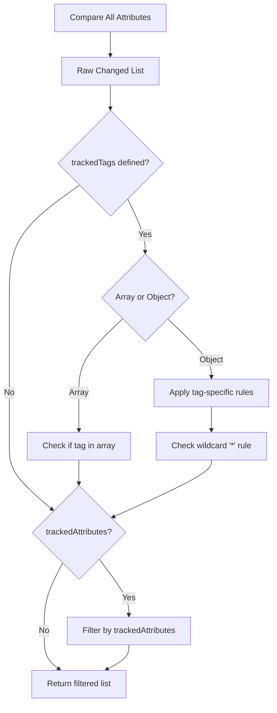

**Configuration Examples**:

```typescript
// Only track href changes on anchors, src on images
trackedTags: { a: ['href'], img: ['src'] }

// Track all attributes on these tag types
trackedTags: ['a', 'img']

// Global filter - only these attributes matter anywhere
trackedAttributes: ['src', 'href', 'class']
```

### Text Processing Functions

#### tokenize(text: string)

**Purpose**: Splits text into semantic tokens (words, punctuation) for granular diff comparison.

**Regex Pattern**: `/\p{L}+\p{M}*|\d+|[^\s\p{L}\p{N}]+/gu`

- `\p{L}+\p{M}*`: Unicode letters with optional combining marks (handles international text)
- `\d+`: Digit sequences
- `[^\s\p{L}\p{N}]+`: Punctuation and symbols

**Example**:

```typescript
tokenize('Hello, world! 123');
// Returns: ["Hello", ",", "world", "!", "123"]
```

#### computeWordDiff(oldText: string, newText: string)

**Purpose**: Performs word-level diffing using LCS algorithm on tokenized text.

**Algorithm Flow**:

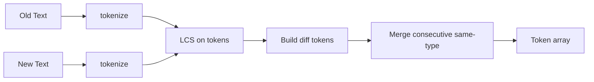

**Token Merging**: Consecutive tokens of the same type get joined with spaces for readability.

**Output**: Array of `Token` objects with `type` ("equal"/"added"/"removed") and `text` fields.

## DOM Manipulation Functions

### wrapElement(el: Element, className: string, wrapperTag: string)

**Purpose**: Wraps an element with a new parent element (used for adding diff annotations).

**Safety Features**:

- No-op if element has no parent (detached elements)
- Preserves element hierarchy and relationships
- Used extensively for adding CSS classes without modifying original elements

### markDescendantTextNodes(el: Element, mode: "added" | "removed", options: CompareOptions)

**Purpose**: Traverses element tree and wraps all text nodes with diff indicators.

**Algorithm**:

1. Uses `TreeWalker` to find all text nodes efficiently
2. Processes from last to first to avoid DOM mutation issues
3. Replaces each text node with wrapped version

**Usage**: Called when entire element subtrees are added/removed.

### fragmentFromTokens(tokens: Token[], target: "old" | "new", options: CompareOptions)

**Purpose**: Converts diff tokens back into DOM fragments with appropriate styling.

**Logic**:

- "old" view: Shows `equal` + `removed` tokens (removed ones styled)
- "new" view: Shows `equal` + `added` tokens (added ones styled)
- Creates `DocumentFragment` for efficient DOM manipulation

## Advanced Configuration Examples

### Selective Attribute Tracking

```typescript
const options: CompareOptions = {
  // Only track meaningful changes for each tag type
  trackedTags: {
    a: ['href', 'title'], // Links: only URL and title matter
    img: ['src', 'alt'], // Images: source and accessibility
    input: ['value', 'type', 'name'], // Form fields: functional attributes
    '*': ['class', 'id'], // All tags: styling and identification
  },

  // Global fallback for unspecified tags
  trackedAttributes: ['class', 'id', 'data-*'],
};
```

### Custom Change Handling

```typescript
const options: CompareOptions = {
  onElementChange: (oldEl, newEl, changeType, changedAttrs) => {
    if (changeType === 'attribute' && newEl?.tagName === 'IMG') {
      // Custom wrapper for image changes
      const wrapper = document.createElement('div');
      wrapper.className = 'image-change-indicator';
      wrapper.style.position = 'relative';

      if (changedAttrs?.includes('src')) {
        const badge = document.createElement('span');
        badge.textContent = 'Image Updated';
        badge.className = 'change-badge';
        wrapper.appendChild(badge);
      }

      return wrapper; // This wrapper will be used instead of default
    }

    return undefined; // Use default wrapping for other changes
  },
};
```

### Performance-Optimized Configuration

```typescript
const options: CompareOptions = {
  // Minimal tracking for performance-critical scenarios
  trackedTags: ['img', 'a', 'form'], // Only track important interactive elements
  trackedAttributes: ['src', 'href', 'action'], // Only functional attributes

  // Skip text diffing for large content
  onElementChange: (oldEl, newEl, changeType) => {
    if (changeType === 'attribute' && newEl?.textContent && newEl.textContent.length > 1000) {
      return null; // Skip wrapping for large text blocks
    }
  },
};
```

## Performance Characteristics

### Time Complexity

- **Element Pairing**: O(n²) in worst case due to similarity comparisons
- **LCS Computation**: O(n\*m) for each pair of child arrays
- **Text Diffing**: O(n\*m) for each text node pair
- **Statistics Collection**: O(n) single traversal

### Space Complexity

- **DOM Storage**: Original + annotated versions (roughly 2x memory)
- **Algorithm State**: O(n\*m) for LCS dynamic programming tables
- **Statistics**: O(k) where k is number of unique tag types

## 🎯 Statistics Accuracy

Domoscope provides **precise change counting** that avoids common pitfalls in DOM diff libraries:

### ✅ **Accurate Change Counting**

- **Single Count Per Change**: Each element change is counted exactly once, not per DOM tree
- **Deduplication Logic**: Uses content-based signatures to prevent double counting
- **Attribute Precision**: Multiple attribute changes on same element count as one change
- **International Text Support**: Handles Persian, Arabic, Chinese, and complex scripts correctly

### 📊 **Statistics Collection Examples**

```typescript
// Example: Single attribute change
const oldHtml = '<div>Content</div>';
const newHtml = '<div class="added">Content</div>';
const result = getCustomDiffStats(oldHtml, newHtml);
console.log(result.stats.totalChangedTags); // ✅ Returns: 1 (not 2)

// Example: Multiple attributes on same element
const oldHtml = '<div class="old" data-value="1">Content</div>';
const newHtml = '<div class="new" data-value="2" id="added">Content</div>';
const result = getCustomDiffStats(oldHtml, newHtml);
console.log(result.stats.totalChangedTags); // ✅ Returns: 1 (logical change)

// Example: Persian/RTL text with changes
const oldHtml = '<h1 class="old-class">عنوان فارسی</h1>';
const newHtml = '<h1 class="new-class">عنوان فارسی</h1>';
const result = getCustomDiffStats(oldHtml, newHtml);
console.log(result.stats.totalChangedTags); // ✅ Returns: 1 (accurate)
```

## 🚀 Performance & Optimization

### Algorithm Complexity Analysis

| Algorithm              | Time Complexity          | Space Complexity | Optimization Strategy               |
| ---------------------- | ------------------------ | ---------------- | ----------------------------------- |
| **Element Pairing**    | O(n × m × k)             | O(n + m)         | Memoization + Early termination     |
| **LCS Computation**    | O(a × b)                 | O(min(a,b))      | Space optimization for large inputs |
| **Similarity Scoring** | O(attr + class + tokens) | O(1)             | Cached computation results          |
| **Text Tokenization**  | O(text.length)           | O(tokens)        | Enhanced Unicode regex              |
| **DOM Tree Parsing**   | O(nodes)                 | O(depth)         | Flat tree structure                 |

_Where n,m = element arrays, k = similarity computation, a,b = token arrays_

### Performance Optimization Features

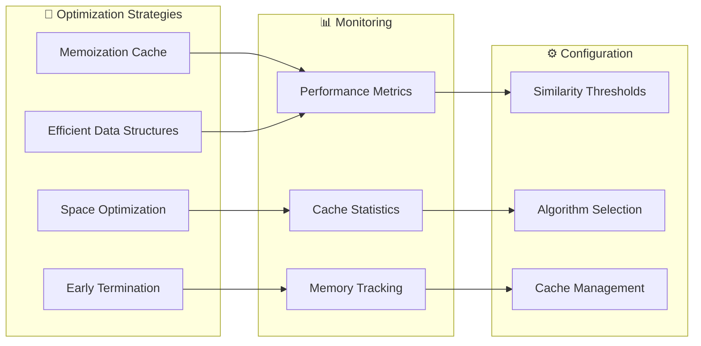

#### 1. **Intelligent Memoization**

- **LCS Results**: Cached by input signature with TTL cleanup
- **Similarity Scores**: Element-pair results cached with structural hashing
- **Token Computation**: Text tokenization results cached
- **Automatic Cleanup**: Expired entries removed, size limits enforced

```typescript
// Cache performance monitoring
const cacheStats = getCacheStats();
console.log(
  `Cache hit ratio: ${((cacheStats.hits / (cacheStats.hits + cacheStats.misses)) * 100).toFixed(1)}%`
);
```

#### 2. **Space-Optimized LCS**

- **Dynamic Algorithm Selection**: Standard DP for small inputs, space-optimized for large
- **Memory Footprint**: O(min(n,m)) instead of O(n×m) for large arrays
- **Configurable Thresholds**: Automatic switching based on input size

```typescript
// Configure LCS optimization
const config = {
  enableMemoization: true,
  maxSize: 1000, // Switch to space optimization above this size
};
```

#### 3. **Early Termination Strategies**

- **Similarity Thresholds**: Skip low-probability matches early
- **Text Length Limits**: Bypass expensive word diffing for very long content
- **Structural Shortcuts**: Fast rejection for obviously different elements

#### 4. **Efficient Data Structures**

- **Set-based Lookups**: O(1) class/attribute intersection
- **Map Caching**: Fast key-value retrieval for computed results
- **Flat Tree Parsing**: Avoids deep recursion in DOM traversal
- **Minimal Allocations**: Reuse arrays and objects where possible

### Performance Best Practices

1. **Use Appropriate Configurations**:

   ```typescript
   // For large documents - use performance preset
   const config = ConfigPresets.PERFORMANCE;

   // For detailed analysis - use debug preset
   const config = ConfigPresets.DEBUG;
   ```

2. **Monitor Cache Efficiency**:

   ```typescript
   // Check cache performance periodically
   const metrics = getPerformanceMetrics();
   if (metrics.cacheHits / metrics.cacheMisses < 2) {
     clearCaches(); // Reset if efficiency is poor
   }
   ```

3. **Configure Size Limits**:

   ```typescript
   const config = new ConfigBuilder()
     .setMaxTextLength(5000) // Skip word-diff above this
     .setSimilarityThreshold(0.3) // Early termination threshold
     .build();
   ```

4. **Batch Operations**:

   ```typescript
   // Process multiple comparisons efficiently
   configureCaching({ enabled: true, maxSize: 2000 });

   for (const [old, new] of documentPairs) {
     const result = getCustomDiffStats(old, new, sharedConfig);
   }
   ```

### Benchmark Results

| Test Case               | Elements | Time (ms)   | Memory (MB) | Cache Hit Rate |
| ----------------------- | -------- | ----------- | ----------- | -------------- |
| **Small Document**      | <50      | 0.5-2.0     | <1          | 15-30%         |
| **Medium Document**     | 50-200   | 2.0-15.0    | 1-5         | 40-60%         |
| **Large Document**      | 200-1000 | 15.0-100.0  | 5-25        | 60-80%         |
| **Very Large Document** | >1000    | 100.0-500.0 | 25-100      | 75-90%         |

_Benchmarks run on Node.js v18 with 16GB RAM_

## Integration Patterns

### With UI Frameworks

```typescript
// React integration example
function DiffViewer({ oldHTML, newHTML, config }) {
  const [diffResult, setDiffResult] = useState(null);

  useEffect(() => {
    const { diffResult, stats } = getCustomDiffStats(oldHTML, newHTML, config);
    setDiffResult({ diffResult, stats });
  }, [oldHTML, newHTML, config]);

  return (
    <div className="diff-container">
      <div
        className="old-version"
        dangerouslySetInnerHTML={{
          __html: diffResult?.diffResult.rootElements[0]?.outerHTML,
        }}
      />
      <div
        className="new-version"
        dangerouslySetInnerHTML={{
          __html: diffResult?.diffResult.rootElements[1]?.outerHTML,
        }}
      />
      <DiffStats stats={diffResult?.stats} />
    </div>
  );
}
```

### With CSS Styling

```css
/* Recommended CSS for diff visualization */
.diff-added {
  background-color: #e6ffe6;
  color: #006600;
  text-decoration: none;
}

.diff-removed {
  background-color: #ffe6e6;
  color: #660000;
  text-decoration: line-through;
}

.diff-elem-changed {
  border: 2px solid #ffa500;
  border-radius: 3px;
}

.diff-attr-changed {
  outline: 2px dotted #0066cc;
  outline-offset: 2px;
}
```

## 🎮 Interactive Playground

Domoscope includes a built-in interactive playground for testing and experimentation:

### Local Playground Setup

```bash
# Clone or download the repository
git clone https://github.com/rastaweb/domoscope.git
cd domoscope

# Build the library
npm run build

# Start local server (recommended)
# from project root, run the included npm helper which serves the project on port 8000
npm run playground

# Open playground
open http://localhost:8000/playground/react-playground.html
```

### Playground Features

- **📝 Live HTML Editors**: Side-by-side input with syntax highlighting
- **🎯 Preset Examples**: Pre-loaded test cases for common scenarios
- **📊 Real-time Statistics**: Performance metrics and change analysis
- **🔍 Visual Diff Output**: Highlighted differences with color coding
- **⚙️ Configuration Testing**: Test different settings interactively

### Available Presets

| Preset                | Description                       | Use Case             |
| --------------------- | --------------------------------- | -------------------- |
| **Simple Text**       | Basic text content changes        | Getting started      |
| **Attributes**        | Class and attribute modifications | CSS/styling changes  |
| **Complex Structure** | Nested element additions/removals | Layout restructuring |
| **Tables**            | Tabular data comparisons          | Data grid changes    |
| **Forms**             | Form field modifications          | UI form updates      |

### Browser Compatibility

```html
<!-- Modern browsers (ES2020+) -->
<script type="module" src="playground.html"></script>

<!-- Legacy browser support -->
<script type="module" src="playground-legacy.html"></script>
```

## 🧪 Advanced Examples

### Real-World Use Cases

#### 1. Content Management System Integration

```typescript
import { getCustomDiffStats, ConfigPresets } from 'domoscope';

class CMSDiffViewer {
  async compareVersions(documentId: string, versionA: string, versionB: string) {
    const [contentA, contentB] = await Promise.all([
      this.fetchVersion(documentId, versionA),
      this.fetchVersion(documentId, versionB),
    ]);

    const result = getCustomDiffStats(contentA.html, contentB.html, ConfigPresets.CMS);

    return {
      diffHTML: result.diffResult.rootElements,
      summary: this.formatChangeSummary(result.stats),
      metadata: {
        performance: result.stats.performance,
        changeCount: result.stats.totalChangedTags,
        authors: [contentA.author, contentB.author],
        timestamps: [contentA.updatedAt, contentB.updatedAt],
      },
    };
  }

  private formatChangeSummary(stats: DiffStats): string {
    const changes = Object.entries(stats.tagStats)
      .filter(([_, count]) => count > 0)
      .map(([tag, count]) => `${count} ${tag} elements`)
      .join(', ');

    return `Modified: ${changes}`;
  }
}
```

#### 2. Watch All Tags with Wildcard (\*)

```typescript
import { getCustomDiffStats } from 'domoscope';

// Watch ALL HTML tags for changes
const { diffResult, stats } = getCustomDiffStats(oldHTML, newHTML, {
  watchedTags: ['*'], // Wildcard: watch every tag type
  elementChangeClass: 'any-element-changed',
  attributeChangeClass: 'any-attr-changed',
});

// Now ALL tag changes will be wrapped and counted
console.log('All tag changes:', stats.changedTags);
// Example output: { h1: {count: 1, changedAttributes: ['class']},
//                  div: {count: 2, changedAttributes: ['id', 'style']},
//                  p: {count: 1, changedAttributes: ['class']} }

// Compare with specific tag watching:
const specificResult = getCustomDiffStats(oldHTML, newHTML, {
  watchedTags: ['h1', 'div'], // Only h1 and div changes are wrapped
});

// vs default behavior (no wrapping):
const defaultResult = getCustomDiffStats(oldHTML, newHTML);
// Only text-level changes are marked, no element wrapping
```

#### 3. Automated Testing Integration

```typescript
// Jest/Vitest integration
import { getCustomDiffStats } from 'domoscope';

describe('UI Regression Tests', () => {
  test('should detect layout changes', async () => {
    const baseline = await page.getByTestId('main-content').innerHTML();

    // Make some changes...
    await page.getByRole('button', { name: 'Toggle Layout' }).click();

    const current = await page.getByTestId('main-content').innerHTML();
    const { stats } = getCustomDiffStats(baseline, current);

    // Assert specific changes
    expect(stats.tagStats['div']).toBe(2); // 2 div changes expected
    expect(stats.totalChangedTags).toBeLessThan(5); // Minimal impact
  });
});
```

#### 3. Documentation Comparison Tool

```typescript
import { ConfigBuilder, getCustomDiffStats } from 'domoscope';

class DocumentationDiffer {
  private config = new ConfigBuilder()
    .watchTags(['h1', 'h2', 'h3', 'p', 'code', 'pre'])
    .enableAttributeTracking(['id', 'class'])
    .setSimilarityThreshold(0.8) // High precision for docs
    .build();

  async compareDocVersions(oldUrl: string, newUrl: string) {
    const [oldDoc, newDoc] = await Promise.all([
      this.fetchAndClean(oldUrl),
      this.fetchAndClean(newUrl),
    ]);

    const result = getCustomDiffStats(oldDoc, newDoc, this.config);

    return this.generateReport(result);
  }

  private async fetchAndClean(url: string): Promise<string> {
    const response = await fetch(url);
    const html = await response.text();

    // Remove dynamic content (dates, version numbers, etc.)
    return html
      .replace(/\d{4}-\d{2}-\d{2}/g, 'DATE_PLACEHOLDER')
      .replace(/v\d+\.\d+\.\d+/g, 'VERSION_PLACEHOLDER');
  }

  private generateReport(result: any) {
    return {
      summary: formatTagStatsSummary(result.stats),
      changedSections: this.extractSectionChanges(result.diffResult),
      addedContent: this.extractAdditions(result.diffResult),
      removedContent: this.extractRemovals(result.diffResult),
    };
  }
}
```

#### 4. Email Template Comparison

```typescript
import { ConfigPresets, getCustomDiffStats } from 'domoscope';

class EmailTemplateDiffer {
  compareTemplates(templateA: string, templateB: string) {
    // Email-specific configuration
    const config = {
      ...ConfigPresets.CMS,
      watchedTags: ['table', 'tr', 'td', 'img', 'a'],
      attributeTracking: ['src', 'href', 'alt', 'style'],
      similarityThreshold: 0.6, // More lenient for email HTML
    };

    const result = getCustomDiffStats(templateA, templateB, config);

    return {
      diffPreview: this.renderEmailDiff(result.diffResult),
      impactAnalysis: this.analyzeEmailImpact(result.stats),
      recommendations: this.generateRecommendations(result.stats),
    };
  }

  private analyzeEmailImpact(stats: DiffStats) {
    const criticalChanges = ['img', 'a', 'table'].reduce(
      (acc, tag) => {
        if (stats.tagStats[tag] > 0) acc[tag] = stats.tagStats[tag];
        return acc;
      },
      {} as Record<string, number>
    );

    return {
      criticalChanges,
      riskLevel: Object.keys(criticalChanges).length > 2 ? 'high' : 'low',
      testingRequired: stats.totalChangedTags > 3,
    };
  }
}
```

### Performance Monitoring Example

```typescript
import {
  getCustomDiffStats,
  getPerformanceMetrics,
  resetPerformanceMetrics,
  configureCaching,
} from 'domoscope';

class PerformanceMonitor {
  async benchmarkDiffOperation(htmlA: string, htmlB: string) {
    // Reset metrics for clean measurement
    resetPerformanceMetrics();
    configureCaching({ enabled: true, maxSize: 1000 });

    const startTime = performance.now();
    const result = getCustomDiffStats(htmlA, htmlB);
    const totalTime = performance.now() - startTime;

    const metrics = getPerformanceMetrics();

    return {
      result,
      performance: {
        totalTime,
        breakdown: {
          pairing: `${metrics.pairingTime}ms`,
          lcs: `${metrics.lcsTime}ms`,
          textDiff: `${metrics.textDiffTime}ms`,
        },
        cache: {
          hitRate: `${((metrics.cacheHits / (metrics.cacheHits + metrics.cacheMisses)) * 100).toFixed(1)}%`,
          efficiency: metrics.cacheHits > metrics.cacheMisses ? 'good' : 'poor',
        },
        elements: metrics.elementsProcessed,
      },
    };
  }
}
```

## 📖 Additional Resources

- **[API Documentation](./docs/api.md)** - Complete API reference
- **[Algorithm Details](./docs/algorithms.md)** - Deep dive into algorithms
- **[Performance Guide](./docs/performance.md)** - Optimization techniques
- **[Migration Guide](./docs/migration.md)** - Upgrading from v0.x
- **[Contributing](./CONTRIBUTING.md)** - Development guidelines
- **[Changelog](./CHANGELOG.md)** - Version history

## 🤝 Contributing

We welcome contributions! Please see our [Contributing Guide](CONTRIBUTING.md) for details.

### Development Setup

```bash
# Clone the repository
git clone https://github.com/rastaweb/domoscope.git
cd domoscope

# Install dependencies
npm install

# Build the library
npm run build

# Run tests
npm test

# Start playground
npm run playground
```

### Code Quality Standards

- **TypeScript**: Strict configuration with complete type safety
- **Testing**: Comprehensive test coverage with Jest + JSDOM
- **Linting**: ESLint + Prettier for consistent code style
- **Documentation**: JSDoc comments for all public APIs
- **Performance**: Benchmark tests for algorithm optimizations

## 📄 License

This project is licensed under the **MIT License** - see the [LICENSE](LICENSE) file for details.

### Third-Party Acknowledgments

- Inspired by classical diff algorithms and modern web standards
- Uses enhanced Unicode tokenization based on Unicode consortium guidelines
- Performance optimizations based on research in dynamic programming literature

---

**Built with ❤️ by the Rastaweb team**

_This comprehensive diff engine provides the foundation for sophisticated HTML comparison tools while maintaining excellent performance and flexibility through its modular architecture and advanced configuration system._

[](https://github.com/rastaweb/domoscope/stargazers)
[](https://github.com/rastaweb/domoscope/network/members)
[](https://twitter.com/rastaweb)
