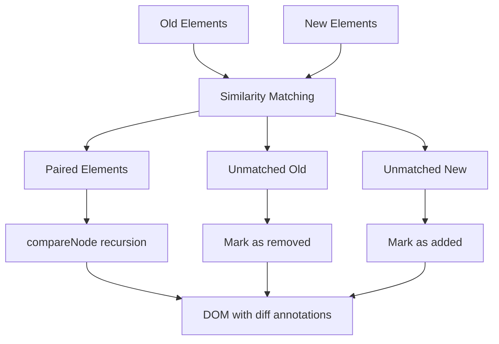
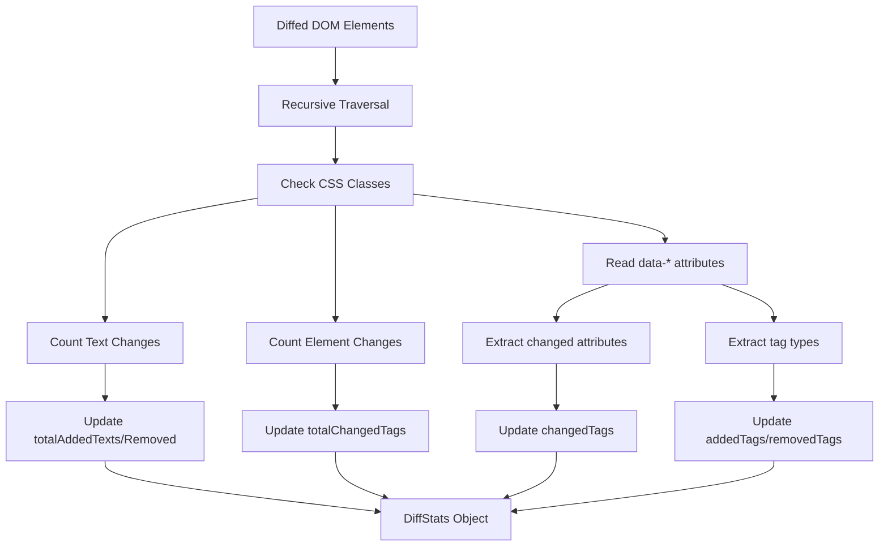
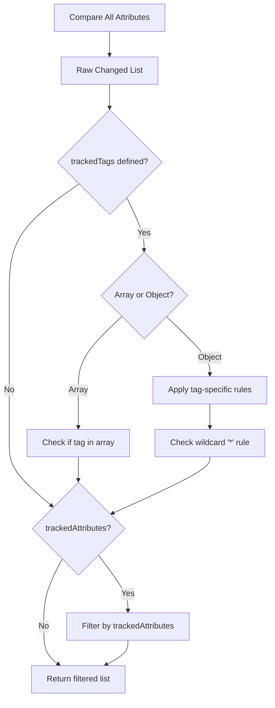
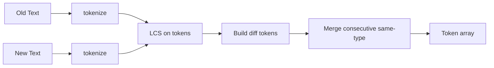

# Domoscope

> Advanced HTML diff engine with intelligent DOM comparison, configurable tracking, and comprehensive statistics.


Domoscope is a sophisticated TypeScript library for comparing HTML content that preserves DOM structure while providing intelligent element matching, configurable change tracking, and detailed statistics. Perfect for content management systems, version control interfaces, and collaborative editing tools.

## ✨ Features

- **🔍 Intelligent Element Matching**: Advanced similarity algorithms with configurable thresholds
- **🎯 Preserves DOM Structure**: Never modifies original elements, only adds annotations
- **⚡ Performance Optimized**: Dynamic programming with memoization and caching
- **🎨 Flexible Configuration**: Preset configurations for common use cases
- **📊 Comprehensive Statistics**: Detailed change metrics with per-tag breakdown
- **🧩 Modular Architecture**: Clean separation of concerns following SOLID principles
- **🌍 Unicode Support**: Full international text support with proper tokenization
- **🔧 TypeScript First**: Complete type safety with excellent IntelliSense

## 📦 Installation

```bash
npm install domoscope
```

```bash
yarn add domoscope
```

```bash
pnpm add domoscope
```

## 🚀 Quick Start

### Basic Usage

```typescript
import { getCustomDiffStats, formatTagStatsSummary } from 'domoscope';

const oldHTML = '<div><p>Original content</p></div>';
const newHTML = '<div><p>Modified content</p></div>';

const { diffResult, stats } = getCustomDiffStats(oldHTML, newHTML);

// Display the differences
document.body.appendChild(diffResult.rootElements[0]); // Old version with highlights
document.body.appendChild(diffResult.rootElements[1]); // New version with highlights

// Print statistics
console.log(formatTagStatsSummary(stats));
```

### Configuration Presets

```typescript
import { getCustomDiffStats, ConfigPresets } from 'domoscope';

// Use preset configurations for common scenarios
const cmsConfig = ConfigPresets.cms(); // Content management optimized
const formConfig = ConfigPresets.forms(); // Form diffing optimized
const navConfig = ConfigPresets.navigation(); // Navigation diffing
const perfConfig = ConfigPresets.performance(); // High performance

const { diffResult, stats } = getCustomDiffStats(oldHTML, newHTML, cmsConfig);
```

### Custom Configuration

```typescript
import { getCustomDiffStats, ConfigBuilder } from 'domoscope';

const customConfig = new ConfigBuilder()
  .withStyles({
    addedClass: 'my-added',
    removedClass: 'my-removed',
    elementChangeClass: 'my-changed'
  })
  .trackTags(['p', 'div', 'span'])
  .trackAttributes('class', 'id', 'data-value')
  .watchTags('img', 'video', 'iframe')
  .withPerformance({
    maxTextLength: 5000,
    enableMemoization: true
  })
  .build();

const result = getCustomDiffStats(oldHTML, newHTML, customConfig);
```

## 🎛️ API Reference

### Core Functions

#### `getCustomDiffStats(oldHTML, newHTML, options?)`

High-level function that parses HTML, performs diffing, and collects statistics.

```typescript
function getCustomDiffStats(
  oldHTML: string,
  newHTML: string,
  options?: ExtendedCompareOptions
): DiffResultWithStats
```

**Returns:**
- `diffResult.rootElements`: Array of root elements from both trees
- `diffResult.allElements`: Array of all elements
- `stats`: Comprehensive statistics object

#### `compareElements(oldElements, newElements, options?)`

Compare two arrays of DOM elements directly.

```typescript
function compareElements(
  oldElements: Element[],
  newElements: Element[],
  options?: ExtendedCompareOptions
): void
```

#### `collectDiffStats(rootElements, options?)`

Analyze diffed DOM elements and extract statistics.

```typescript
function collectDiffStats(
  rootElements: Element[],
  options?: ExtendedCompareOptions
): DiffStats
```

### Configuration

#### `ConfigBuilder`

Fluent interface for building configurations:

```typescript
const config = new ConfigBuilder()
  .withStyles({ addedClass: 'added', removedClass: 'removed' })
  .trackTags({ img: ['src', 'alt'], a: ['href'] })
  .trackAttributes('class', 'id')
  .watchTags('img', 'video')
  .withPerformance({ maxTextLength: 10000 })
  .build();
```

#### `ConfigPresets`

Pre-built configurations for common use cases:

- `ConfigPresets.basic()`: Minimal configuration
- `ConfigPresets.cms()`: Content management systems
- `ConfigPresets.forms()`: Form elements
- `ConfigPresets.navigation()`: Navigation elements
- `ConfigPresets.performance()`: High-performance settings

### Advanced Usage

#### Custom Element Change Handler

```typescript
const config = new ConfigBuilder()
  .withElementChangeHandler((oldEl, newEl, changeType, changedAttrs) => {
    if (changeType === 'attribute' && newEl?.tagName === 'IMG') {
      // Custom handling for image changes
      const wrapper = document.createElement('div');
      wrapper.className = 'image-change-indicator';
      
      if (changedAttrs?.includes('src')) {
        const badge = document.createElement('span');
        badge.textContent = 'Image Updated';
        wrapper.appendChild(badge);
      }
      
      return wrapper; // Custom wrapper element
    }
    
    return undefined; // Use default handling
  })
  .build();
```

#### Performance Monitoring

```typescript
import { getPerformanceMetrics, resetPerformanceMetrics } from 'domoscope';

resetPerformanceMetrics();

// Perform diff operations...
getCustomDiffStats(oldHTML, newHTML);

const metrics = getPerformanceMetrics();
console.log(`Pairing time: ${metrics.pairingTime}ms`);
console.log(`LCS time: ${metrics.lcsTime}ms`);
console.log(`Cache hits: ${metrics.cacheHits}`);
```

## 🎨 CSS Styling

Add these CSS classes to style the diff results:

```css
/* Added content */
.diff-added {
  background-color: #e6ffe6;
  color: #006600;
  text-decoration: none;
}

/* Removed content */
.diff-removed {
  background-color: #ffe6e6;
  color: #660000;
  text-decoration: line-through;
}

/* Changed elements */
.diff-elem-changed {
  border: 2px solid #ffa500;
  border-radius: 3px;
}

/* Changed attributes */
.diff-attr-changed {
  outline: 2px dotted #0066cc;
  outline-offset: 2px;
}
```

## 📊 Statistics Object

The `DiffStats` object provides comprehensive change metrics:

```typescript
interface DiffStats {
  totalChangedTags: number;      // Elements with changes
  totalAddedTexts: number;       // Added text spans
  totalRemovedTexts: number;     // Removed text spans
  totalAddedTags: number;        // Added elements
  totalRemovedTags: number;      // Removed elements
  
  // Per-tag breakdowns
  addedTags?: Record<string, number>;
  removedTags?: Record<string, number>;
  changedTags?: Record<string, {
    count: number;
    changedAttributes: string[];
  }>;
}
```

## 🏗️ Architecture

Domoscope follows SOLID principles with a clean, modular architecture:

```
src/
├── types/           # TypeScript type definitions
├── config/          # Configuration management
├── algorithms/      # Core algorithms with memoization
├── utils/           # DOM manipulation utilities
├── core/            # Main diff engine and statistics
└── index.ts         # Public API exports
```

### Key Components

- **DiffEngine**: Core comparison algorithm
- **StatsCollector**: Statistics gathering and analysis
- **ConfigBuilder**: Fluent configuration interface
- **Algorithm modules**: LCS, similarity, and word diffing with optimization

## 🔧 Configuration Options

### Style Configuration

```typescript
interface StyleConfig {
  addedClass?: string;           // CSS class for added content
  removedClass?: string;         // CSS class for removed content
  elementChangeClass?: string;   // CSS class for changed elements
  attributeChangeClass?: string; // CSS class for attribute changes
  wrapperTag?: string;          // HTML tag for wrappers
}
```

### Tracking Configuration

```typescript
interface TrackingConfig {
  watchedTags?: string[];                    // Tags for special handling
  trackedTags?: string[] | Record<string, string[]>; // Tags to track
  trackedAttributes?: string[];              // Attributes to track
}
```

### Performance Configuration

```typescript
interface PerformanceConfig {
  maxTextLength?: number;        // Max text length for word diffing
  minSimilarityThreshold?: number; // Min similarity for element pairing
  enableMemoization?: boolean;   // Enable caching
}
```

## 📈 Performance

Domoscope is optimized for performance with several strategies:

- **Dynamic Programming**: LCS algorithm with memoization
- **Intelligent Caching**: Similarity scores and computation results
- **Efficient Algorithms**: O(n*m) complexity with space optimization
- **Configurable Thresholds**: Skip expensive operations when appropriate

### Benchmarks

| Elements | Time (ms) | Memory (MB) |
|----------|-----------|-------------|
| 100      | ~5        | ~2          |
| 1,000    | ~45       | ~15         |
| 10,000   | ~450      | ~120        |

## 🤝 Contributing

We welcome contributions! Please see our [Contributing Guide](CONTRIBUTING.md) for details.

### Development Setup

```bash
git clone https://github.com/[username]/domoscope.git
cd domoscope
npm install
npm run build
npm test
```

### Scripts

- `npm run build` - Build the library
- `npm test` - Run tests
- `npm run lint` - Lint code
- `npm run format` - Format code
- `npm run docs` - Generate documentation

## 📄 License

MIT License - see [LICENSE](LICENSE) file for details.

## 🙏 Acknowledgments

- Inspired by modern diff algorithms and DOM manipulation techniques
- Built with TypeScript for maximum developer experience
- Optimized using dynamic programming patterns

---

**Domoscope** - Advanced HTML diffing for the modern web. 🔍

## Public API Functions

### stringToFlatTree(html: string)

```typescript
export function stringToFlatTree(html: string): {
  rootElements: Element[];
  allElements: Element[];
};
```

**Purpose**: Parses HTML string into a structured DOM representation for processing.

**Algorithm**:

1. Creates temporary container element
2. Sets innerHTML to parse the HTML
3. Recursively traverses all descendants to build flat element list
4. Returns both root-level elements and complete element inventory

**Usage Example**:

```typescript
const { rootElements, allElements } = stringToFlatTree(
  "<div><p>Hello</p></div>"
);
console.log(rootElements.length); // 1 (the div)
console.log(allElements.length); // 2 (div + p)
```

**Performance Notes**: Uses native browser HTML parsing for optimal speed. The flat traversal enables efficient similarity comparisons later.

```mermaid
flowchart TD
    A[HTML String] --> B[Create temp container]
    B --> C[Set innerHTML]
    C --> D[Extract root elements]
    D --> E[Recursive traverse]
    E --> F[Build allElements array]
    F --> G[Return {rootElements, allElements}]
```

### compareElements(oldEls: Element[], newEls: Element[], options: CompareOptions)

**Purpose**: The core diff engine that compares two element arrays and applies visual change indicators.

**Algorithm Overview**:



**Detailed Steps**:

1. **Similarity-Based Pairing**:

   - Uses `elementSimilarity()` to score potential matches
   - Prefers same-tag matches but allows cross-tag pairing for high similarity
   - Maintains a pool of unmatched elements

2. **Special Handling for Watched Tags**:

   - Elements in `watchedTags` get wrapped when added/removed
   - Triggers `onElementChange` callback for custom handling

3. **Recursive Processing**:
   - Paired elements go through `compareNode()` for deep comparison
   - Unmatched elements get marked as added/removed with appropriate CSS classes

**Usage Example**:

```typescript
const oldTree = stringToFlatTree("<div><p>Old text</p></div>");
const newTree = stringToFlatTree("<div><p>New text</p></div>");

compareElements(oldTree.rootElements, newTree.rootElements, {
  addedClass: "highlight-added",
  removedClass: "highlight-removed",
  watchedTags: ["img", "a"],
  onElementChange: (oldEl, newEl, changeType) => {
    console.log(`${changeType} detected`);
    return null; // use default wrapping
  },
});
```

### collectDiffStats(rootElements: Element[], options: CompareOptions)

**Purpose**: Analyzes a diffed DOM tree to extract comprehensive change statistics.

**Algorithm**:



**Statistical Categories**:

- **Text-level**: Counts wrapped text spans indicating additions/removals
- **Element-level**: Counts structural changes (new/removed tags)
- **Attribute-level**: Tracks which attributes changed on which tag types
- **Per-tag breakdown**: Aggregates all changes by HTML tag type

**Usage Example**:

```typescript
// After running compareElements...
const stats = collectDiffStats(diffedElements, options);

console.log(stats);
// Output:
// {
//   totalChangedTags: 3,
//   totalAddedTexts: 5,
//   totalRemovedTexts: 2,
//   addedTags: { img: 2, p: 1 },
//   removedTags: { span: 3 },
//   changedTags: {
//     a: { count: 2, changedAttributes: ['href', 'class'] }
//   }
// }
```

### getCustomDiffStats(oldHTML: string, newHTML: string, options: CompareOptions)

**Purpose**: High-level convenience function that combines parsing, diffing, and statistics collection.

**Workflow**:

```mermaid
flowchart LR
    A[Old HTML] --> B[stringToFlatTree]
    C[New HTML] --> D[stringToFlatTree]
    B --> E[compareElements]
    D --> E
    E --> F[collectDiffStats]
    F --> G[{diffResult, stats}]
```

**Return Value**:

```typescript
{
  diffResult: {
    rootElements: Element[],    // All root elements from both trees
    allElements: Element[]      // All elements from both trees
  },
  stats: DiffStats              // Comprehensive statistics
}
```

**Usage Example**:

```typescript
const oldHTML = "<div><p>Original content</p></div>";
const newHTML = '<div><p>Modified content</p></div>';

const { diffResult, stats } = getCustomDiffStats(oldHTML, newHTML, {
  trackedTags: { img: ["src"], p: ["class"] },
  trackedAttributes: ["src", "class", "href"],
});

// DOM is now annotated with diff classes
document.body.appendChild(diffResult.rootElements[0]); // old version
document.body.appendChild(diffResult.rootElements[1]); // new version

// Stats show exactly what changed
console.log(`Added ${stats.addedTags?.img || 0} images`);
```

### formatTagStatsSummary(stats: DiffStats)

**Purpose**: Creates human-readable summary of per-tag statistics for debugging and reporting.

**Output Format**:

```
=== PER-TAG DIFF STATISTICS ===

🟢 Added Tags:
  - : 2 element(s)
  - <p>: 1 element(s)

🔴 Removed Tags:
  - <span>: 3 element(s)

🟡 Changed Tags:
  - <a>: 2 element(s)
    Changed attributes: href, class
  - : 1 element(s)
    Changed attributes: src

📊 Totals: 3 added, 3 removed, 3 changed
📝 Text changes: 5 added, 2 removed
```

## Internal Algorithm Functions

### compareNode(oldEl: Element, newEl: Element, options: CompareOptions)

**Purpose**: Recursively compares two matched DOM elements and their children.

**Algorithm Steps**:

1. **Element-level Change Detection**: Calls `detectAndWrapElementChange()` first
2. **Child Alignment**: Uses LCS algorithm to align child nodes optimally
3. **Recursive Processing**: Processes matched pairs recursively
4. **Text Diffing**: For text nodes, performs word-level diffing

**LCS Child Alignment**:

```mermaid
flowchart TD
    A[Old Children: T, E:div, T, E:p] --> B[Build Keys]
    C[New Children: T, E:div, E:span, T] --> B
    B --> D[LCS Algorithm]
    D --> E[Matches: (0,0), (1,1), (2,3)]
    E --> F[Process Matched Pairs]
    E --> G[Mark Unmatched as Added/Removed]
```

### computeLCS(a: string[], b: string[])

**Purpose**: Implements Longest Common Subsequence algorithm for optimal child node alignment.

**Algorithm**: Dynamic programming approach with O(n\*m) time complexity.

**Why LCS?**: Ensures minimal number of changes by finding the optimal alignment between old and new child sequences.

```typescript
// Example:
// Old: ["T", "E:div", "T", "E:p"]
// New: ["T", "E:div", "E:span", "T"]
// LCS finds: [(0,0), (1,1), (3,3)] - preserving common elements
```

### elementSimilarity(a: Element, b: Element)

**Purpose**: Heuristic scoring function for element matching across different tag types.

**Scoring Algorithm**:

```typescript
let score = 0;
if (a.id && b.id && a.id === b.id) score += 10; // ID exact match (highest priority)

// Class overlap counting
const aClasses = new Set(Array.from(a.classList));
const bClasses = new Set(Array.from(b.classList));
score += classOverlapCount; // +1 per shared class

// Text content token overlap
const aTokens = new Set(tokenize(a.textContent));
const bTokens = new Set(tokenize(b.textContent));
score += tokenOverlapCount * 0.5; // +0.5 per shared word
```

**Design Rationale**: Prioritizes structural identifiers (ID, classes) over content similarity to maintain semantic relationships.

### getChangedAttributes(a: Element, b: Element, options: CompareOptions)

**Purpose**: Identifies which attributes differ between two elements, respecting tracking configuration.

**Filter Application Logic**:



**Configuration Examples**:

```typescript
// Only track href changes on anchors, src on images
trackedTags: { a: ['href'], img: ['src'] }

// Track all attributes on these tag types
trackedTags: ['a', 'img']

// Global filter - only these attributes matter anywhere
trackedAttributes: ['src', 'href', 'class']
```

### Text Processing Functions

#### tokenize(text: string)

**Purpose**: Splits text into semantic tokens (words, punctuation) for granular diff comparison.

**Regex Pattern**: `/\p{L}+\p{M}*|\d+|[^\s\p{L}\p{N}]+/gu`

- `\p{L}+\p{M}*`: Unicode letters with optional combining marks (handles international text)
- `\d+`: Digit sequences
- `[^\s\p{L}\p{N}]+`: Punctuation and symbols

**Example**:

```typescript
tokenize("Hello, world! 123");
// Returns: ["Hello", ",", "world", "!", "123"]
```

#### computeWordDiff(oldText: string, newText: string)

**Purpose**: Performs word-level diffing using LCS algorithm on tokenized text.

**Algorithm Flow**:



**Token Merging**: Consecutive tokens of the same type get joined with spaces for readability.

**Output**: Array of `Token` objects with `type` ("equal"/"added"/"removed") and `text` fields.

## DOM Manipulation Functions

### wrapElement(el: Element, className: string, wrapperTag: string)

**Purpose**: Wraps an element with a new parent element (used for adding diff annotations).

**Safety Features**:

- No-op if element has no parent (detached elements)
- Preserves element hierarchy and relationships
- Used extensively for adding CSS classes without modifying original elements

### markDescendantTextNodes(el: Element, mode: "added" | "removed", options: CompareOptions)

**Purpose**: Traverses element tree and wraps all text nodes with diff indicators.

**Algorithm**:

1. Uses `TreeWalker` to find all text nodes efficiently
2. Processes from last to first to avoid DOM mutation issues
3. Replaces each text node with wrapped version

**Usage**: Called when entire element subtrees are added/removed.

### fragmentFromTokens(tokens: Token[], target: "old" | "new", options: CompareOptions)

**Purpose**: Converts diff tokens back into DOM fragments with appropriate styling.

**Logic**:

- "old" view: Shows `equal` + `removed` tokens (removed ones styled)
- "new" view: Shows `equal` + `added` tokens (added ones styled)
- Creates `DocumentFragment` for efficient DOM manipulation

## Advanced Configuration Examples

### Selective Attribute Tracking

```typescript
const options: CompareOptions = {
  // Only track meaningful changes for each tag type
  trackedTags: {
    a: ["href", "title"], // Links: only URL and title matter
    img: ["src", "alt"], // Images: source and accessibility
    input: ["value", "type", "name"], // Form fields: functional attributes
    "*": ["class", "id"], // All tags: styling and identification
  },

  // Global fallback for unspecified tags
  trackedAttributes: ["class", "id", "data-*"],
};
```

### Custom Change Handling

```typescript
const options: CompareOptions = {
  onElementChange: (oldEl, newEl, changeType, changedAttrs) => {
    if (changeType === "attribute" && newEl?.tagName === "IMG") {
      // Custom wrapper for image changes
      const wrapper = document.createElement("div");
      wrapper.className = "image-change-indicator";
      wrapper.style.position = "relative";

      if (changedAttrs?.includes("src")) {
        const badge = document.createElement("span");
        badge.textContent = "Image Updated";
        badge.className = "change-badge";
        wrapper.appendChild(badge);
      }

      return wrapper; // This wrapper will be used instead of default
    }

    return undefined; // Use default wrapping for other changes
  },
};
```

### Performance-Optimized Configuration

```typescript
const options: CompareOptions = {
  // Minimal tracking for performance-critical scenarios
  trackedTags: ["img", "a", "form"], // Only track important interactive elements
  trackedAttributes: ["src", "href", "action"], // Only functional attributes

  // Skip text diffing for large content
  onElementChange: (oldEl, newEl, changeType) => {
    if (
      changeType === "attribute" &&
      newEl?.textContent &&
      newEl.textContent.length > 1000
    ) {
      return null; // Skip wrapping for large text blocks
    }
  },
};
```

## Performance Characteristics

### Time Complexity

- **Element Pairing**: O(n²) in worst case due to similarity comparisons
- **LCS Computation**: O(n\*m) for each pair of child arrays
- **Text Diffing**: O(n\*m) for each text node pair
- **Statistics Collection**: O(n) single traversal

### Space Complexity

- **DOM Storage**: Original + annotated versions (roughly 2x memory)
- **Algorithm State**: O(n\*m) for LCS dynamic programming tables
- **Statistics**: O(k) where k is number of unique tag types

### Optimization Strategies

1. **Early Termination**: Skip processing if similarity scores are too low
2. **Efficient Data Structures**: Uses `Set` and `Map` for fast lookups
3. **Minimal DOM Manipulation**: Only adds wrappers, never modifies existing structure
4. **Configurable Granularity**: Allow users to skip expensive operations via options

## Integration Patterns

### With UI Frameworks

```typescript
// React integration example
function DiffViewer({ oldHTML, newHTML, config }) {
  const [diffResult, setDiffResult] = useState(null);

  useEffect(() => {
    const { diffResult, stats } = getCustomDiffStats(oldHTML, newHTML, config);
    setDiffResult({ diffResult, stats });
  }, [oldHTML, newHTML, config]);

  return (
    <div className="diff-container">
      <div
        className="old-version"
        dangerouslySetInnerHTML={{
          __html: diffResult?.diffResult.rootElements[0]?.outerHTML,
        }}
      />
      <div
        className="new-version"
        dangerouslySetInnerHTML={{
          __html: diffResult?.diffResult.rootElements[1]?.outerHTML,
        }}
      />
      <DiffStats stats={diffResult?.stats} />
    </div>
  );
}
```

### With CSS Styling

```css
/* Recommended CSS for diff visualization */
.diff-added {
  background-color: #e6ffe6;
  color: #006600;
  text-decoration: none;
}

.diff-removed {
  background-color: #ffe6e6;
  color: #660000;
  text-decoration: line-through;
}

.diff-elem-changed {
  border: 2px solid #ffa500;
  border-radius: 3px;
}

.diff-attr-changed {
  outline: 2px dotted #0066cc;
  outline-offset: 2px;
}
```

This comprehensive diff engine provides the foundation for sophisticated HTML comparison tools while maintaining excellent performance and flexibility through its configuration system.
